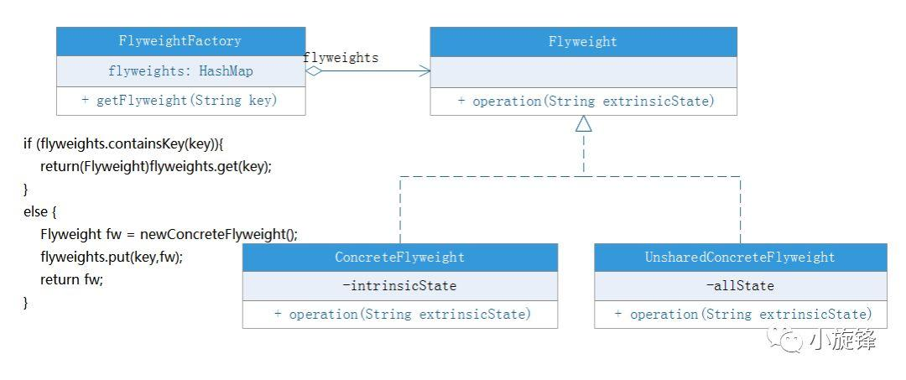

# 设计模式之享元模式及典型应用

## :man: 前言

本文的主要内容：

- 介绍享元模式

- 示例-云盘

- 总结

- 源码分析享元模式的典型应用

- - String中的享元模式
  - Integer中的享元模式
  - Long中的享元模式
  - Apache Common Pool2中的享元模式

## :building_construction:  享元模式

**享元模式(Flyweight Pattern)**：<font color='red'>运用共享技术有效地支持大量细粒度对象的复用</font>。系统只使用少量的对象，而这些对象都很相似，状态变化很小，可以实现对象的多次复用。由于享元模式要求能够共享的对象必须是细粒度对象，因此它又称为轻量级模式，它是一种对象结构型模式。享元模式结构较为复杂，一般结合工厂模式一起使用。

### :arrow_lower_right: 角色

**Flyweight（抽象享元类）**：通常是一个接口或抽象类，在抽象享元类中声明了具体享元类公共的方法，这些方法可以向外界提供享元对象的内部数据（**内部状态**），同时也可以通过这些方法来设置外部数据（**外部状态**）。

**ConcreteFlyweight（具体享元类）**：它实现了抽象享元类，其实例称为享元对象；在具体享元类中为内部状态提供了存储空间。通常我们可以结合单例模式来设计具体享元类，为每一个具体享元类提供唯一的享元对象。

**UnsharedConcreteFlyweight（非共享具体享元类）**：并不是所有的抽象享元类的子类都需要被共享，不能被共享的子类可设计为非共享具体享元类；当需要一个非共享具体享元类的对象时可以直接通过实例化创建。

**FlyweightFactory（享元工厂类）**：享元工厂类用于创建并管理享元对象，它针对抽象享元类编程，将各种类型的具体享元对象存储在一个享元池中，享元池一般设计为一个存储“键值对”的集合（也可以是其他类型的集合），可以结合工厂模式进行设计；当用户请求一个具体享元对象时，享元工厂提供一个存储在享元池中已创建的实例或者创建一个新的实例（如果不存在的话），返回新创建的实例并将其存储在享元池中。

> **单纯享元模式：**在单纯享元模式中，所有的具体享元类都是可以共享的，不存在非共享具体享元类。   
> **复合享元模式：**将一些单纯享元对象使用组合模式加以组合，还可以形成复合享元对象，这样的复合享元对象本身不能共享，但是它们可以分解成单纯享元对象，而后者则可以共享

在享元模式中引入了享元工厂类，享元工厂类的作用在于提供一个用于存储享元对象的享元池，当用户需要对象时，首先从享元池中获取，如果享元池中不存在，则创建一个新的享元对象返回给用户，并在享元池中保存该新增对象。

典型的享元工厂类的代码如下：

```java
class FlyweightFactory {
    //定义一个HashMap用于存储享元对象，实现享元池
    private HashMap flyweights = newHashMap();
    public Flyweight getFlyweight(String key){
        //如果对象存在，则直接从享元池获取
        if(flyweights.containsKey(key)){
            return(Flyweight)flyweights.get(key);
        }
        //如果对象不存在，先创建一个新的对象添加到享元池中，然后返回
        else {
            Flyweight fw = newConcreteFlyweight();
            flyweights.put(key,fw);
            return fw;
        }
    }
}
```

享元类的设计是享元模式的要点之一，在享元类中要将内部状态和外部状态分开处理，通常将内部状态作为享元类的成员变量，而外部状态通过注入的方式添加到享元类中。

典型的享元类代码如下所示：

```java
class Flyweight {
    //内部状态intrinsicState作为成员变量，同一个享元对象其内部状态是一致的
    private String intrinsicState;
    public Flyweight(String intrinsicState) {
        this.intrinsicState=intrinsicState;
    }
    //外部状态extrinsicState在使用时由外部设置，不保存在享元对象中，即使是同一个对象
    public void operation(String extrinsicState) {
        //......
    }
}
```

享元模式一般的类图如下

享元模式类图

------

-------

## 示例:fire:

一般网盘对于相同的文件只保留一份，譬如有一个场景：当我们上传一部别人上传过的电影，会发现很快就上传完成了，实际上不是真的上传，而是引用别人曾经上传过的那部电影，这样一可以提高我们的用户体验，二可以节约存储空间避免资源浪费

> 注意：这个场景是小编想的，与一般见到的例子不太一样，小编其实不确定是不是享元模式，请大家多多指教


首先定义一个工具类` HashUtil`，计算内容的hash值

```java
public class HashUtil {
    public static String computeHashId(String key) {
        String cacheKey;
        try {
            final MessageDigest mDigest = MessageDigest.getInstance("MD5");
            mDigest.update(key.getBytes());
            cacheKey = bytesToHexString(mDigest.digest());
        } catch (NoSuchAlgorithmException e) {
            cacheKey = String.valueOf(key.hashCode());
        }
        return cacheKey;
    }

    private static String bytesToHexString(byte[] bytes) {
        // http://stackoverflow.com/questions/332079
        StringBuilder sb = new StringBuilder();
        for (int i = 0; i < bytes.length; i++) {
            String hex = Integer.toHexString(0xFF & bytes[i]);
            if (hex.length() == 1) {
                sb.append('0');
            }
            sb.append(hex);
        }
        return sb.toString();
    }
}
```


资源类 `Resource`，相当于享元类的内部状态

```
public class Resource {
    private String hashId;
    private int byteSize;
    private String content;

    public Resource(String content) {
        this.content = content;
        this.hashId = HashUtil.computeHashId(content);   // 文件的hash值
        this.byteSize = content.length();
    }
    // ....getter、setter、toString...
}
```

用户的文件类` File`，其中的 resource 为内部状态，owner和filename为外部状态

```java
public  class File {
    protected String owner;
    protected String filename;
    protected Resource resource;

    public File(String owner, String filename) {
        this.owner = owner;
        this.filename = filename;
    }

    public String fileMeta() {// 文件存储到文件系统中需要的key
        if (this.owner == null || filename == null || resource == null) {
            return "未知文件";
        }
        return owner + "-" + filename + resource.getHashId();
    }


    public String display() {
        return fileMeta() + ", 资源内容：" + getResource().toString();
    }
    // ....getter、setter、toString...
}
```


网盘类 `PanServer`，该类使用**单例模式**（在其他例子中该类还使用工厂方法模式），在upload方法中根据所上传的文件的hashId判断是否已经有相同内容的文件存在，存在则引用，不存在才上传该文件

```java
public class PanServer {
    private static PanServer panServer = new PanServer(); // 单例模式
    private Map<String, Resource> resourceSystem; // 资源系统，相当于享元池
    private Map<String, File> fileSystem;   // 文件系统

    private PanServer() {
        resourceSystem = new HashMap<String, Resource>();
        fileSystem = new HashMap<String, File>();
    }

    public static PanServer getInstance() {
        return panServer;
    }

    public String upload(String username, LocalFile localFile) {
        long startTime = System.currentTimeMillis();
        File file = new File(username, localFile.getFilename());
        String hashId = HashUtil.computeHashId(localFile.getContent());     // 计算文件hash值
        System.out.println(username + " 上传文件");
        try {
            if (resourceSystem.containsKey(hashId)) {
                System.out.println(String.format("检测到内容相同的文件《%s》，为了节约空间，重用文件", localFile.getFilename()));
                file.setResource(this.resourceSystem.get(hashId));
                Thread.sleep(100);
            } else {
                System.out.println(String.format("文件《%s》上传中....", localFile.getFilename()));
                Resource newResource = new Resource(localFile.getContent());
                file.setResource(newResource);
                this.resourceSystem.put(newResource.getHashId(), newResource); // 将资源对象存储到资源池中
                Thread.sleep(3000);     // 上传文件需要耗费一定时间
            }
        } catch (Exception e) {
            e.printStackTrace();
        }
        fileSystem.put(file.fileMeta(), file);
        long endTime = System.currentTimeMillis();
        System.out.println(String.format("文件上传完成，共耗费 %s 毫秒n", endTime - startTime));
        return file.fileMeta();
    }


    public void download(String fileKey) {
        File file = this.fileSystem.get(fileKey);
        if (file == null) {
            System.out.println("文件不存在");
        } else {
            System.out.println("下载文件：" + file.display());
        }
        // 转为 LocalFile 返回
    }
}
```

客户端和本地文件类

```java
public class LocalFile {
    private String filename;
    private String content;

    public LocalFile(String filename, String content) {
        this.filename = filename;
        this.content = content;
    }
    //...省略...
}

public class Test {
    public static void main(String[] args) {
        PanServer panServer = PanServer.getInstance();

        String fileContent = "这是一个pdf文件《设计模式：从入门到放弃》";
        LocalFile localFile1 = new LocalFile("小明的设计模式.pdf", fileContent);
        String fikeKey1 = panServer.upload("小明", localFile1);

        LocalFile localFile2 = new LocalFile("大明的设计模式.pdf", fileContent);
        String fikeKey2 = panServer.upload("大明", localFile2);

        panServer.download(fikeKey1);
        panServer.download(fikeKey2);
    }
}
```

输出

```tex
小明 上传文件
文件《小明的设计模式.pdf》上传中....
文件上传完成，共耗费 3077 毫秒

大明 上传文件
检测到内容相同的文件《大明的设计模式.pdf》，为了节约空间，重用文件
文件上传完成，共耗费 100 毫秒

下载文件：小明-小明的设计模式.pdf-f73ea50f00f87b42d1f2e4eb6b71d383, 资源内容：Resource {hashId='f73ea50f00f87b42d1f2e4eb6b71d383', byteSize=22, content='这是一个pdf文件《设计模式：从入门到放弃》'}
下载文件：大明-大明的设计模式.pdf-f73ea50f00f87b42d1f2e4eb6b71d383, 资源内容：Resource {hashId='f73ea50f00f87b42d1f2e4eb6b71d383', byteSize=22, content='这是一个pdf文件《设计模式：从入门到放弃》'}
```

小明和大明各自上传了一份文件，文件的内容（内部状态）是相同的，但是名称（外部状态）不同，由于内部状态相同没有必要重复存储，所以内部状态之拷贝了一份

## 享元模式总结

享元模式的**主要优点**如下：

- 可以极大减少内存中对象的数量，使得相同或相似对象在内存中只保存一份，从而可以节约系统资源，提高系统性能。
- 享元模式的外部状态相对独立，而且不会影响其内部状态，从而使得享元对象可以在不同的环境中被共享。

享元模式的**主要缺点**如下：

- 享元模式使得系统变得复杂，需要分离出内部状态和外部状态，这使得程序的逻辑复杂化。
- 为了使对象可以共享，享元模式需要将享元对象的部分状态外部化，而读取外部状态将使得运行时间变长。

**适用场景**：

- 一个系统有大量相同或者相似的对象，造成内存的大量耗费。
- 对象的大部分状态都可以外部化，可以将这些外部状态传入对象中。
- 在使用享元模式时需要维护一个存储享元对象的享元池，而这需要耗费一定的系统资源，因此，应当在需要多次重复使用享元对象时才值得使用享元模式。

## 源码分析享元模式的典型应用

#### String中的享元模式

Java中将String类定义为final（不可改变的），JVM中字符串一般保存在字符串常量池中，java会确保一个字符串在常量池中只有一个拷贝，这个字符串常量池在JDK6.0以前是位于常量池中，位于永久代，而在JDK7.0中，JVM将其从永久代拿出来放置于堆中。

我们做一个测试：

```java
public class Main {
    public static void main(String[] args) {
        String s1 = "hello";
        String s2 = "hello";
        String s3 = "he" + "llo";
        String s4 = "hel" + new String("lo");
        String s5 = new String("hello");
        String s6 = s5.intern();
        String s7 = "h";
        String s8 = "ello";
        String s9 = s7 + s8;
        System.out.println(s1==s2);//true
        System.out.println(s1==s3);//true
        System.out.println(s1==s4);//false
        System.out.println(s1==s9);//false
        System.out.println(s4==s5);//false
        System.out.println(s1==s6);//true
    }
}
```

String类的`final`修饰的，以字面量的形式创建String变量时，jvm会在编译期间就把该字面量`hello`放到字符串常量池中，由Java程序启动的时候就已经加载到内存中了。这个字符串常量池的特点就是有且只有一份相同的字面量，如果有其它相同的字面量，jvm则返回这个字面量的引用，如果没有相同的字面量，则在字符串常量池创建这个字面量并返回它的引用。

由于s2指向的字面量`hello`在常量池中已经存在了（s1先于s2），于是jvm就返回这个字面量绑定的引用，所以`s1==s2`。

s3中字面量的拼接其实就是`hello`，jvm在编译期间就已经对它进行优化，所以s1和s3也是相等的。

s4中的`new String("lo")`生成了两个对象，`lo`，`new String("lo")`，`lo`存在字符串常量池，`new String("lo")`存在堆中，`String s4 = "hel" + new String("lo")`实质上是两个对象的相加，编译器不会进行优化，相加的结果存在堆中，而s1存在字符串常量池中，当然不相等。`s1==s9`的原理一样。

`s4==s5`两个相加的结果都在堆中，不用说，肯定不相等。

`s1==s6`中，`s5.intern()`方法能使一个位于堆中的字符串在运行期间动态地加入到字符串常量池中（字符串常量池的内容是程序启动的时候就已经加载好了），如果字符串常量池中有该对象对应的字面量，则返回该字面量在字符串常量池中的引用，否则，创建复制一份该字面量到字符串常量池并返回它的引用。因此`s1==s6`输出true。

#### Integer 中的享元模式

使用例子如下：

```java
    public static void main(String[] args) {
        Integer i1 = 12 ;
        Integer i2 = 12 ;
        System.out.println(i1 == i2);

        Integer b1 = 128 ;
        Integer b2 = 128 ;
        System.out.println(b1 == b2);
    }
```

输出是

```tex
true
false
```

为什么第一个是true，第二个是false？
反编译后可以发现 `Integer b1 = 128;` 实际变成了 `Integer b1 = Integer.valueOf(128);`，所以我们来看 `Integer` 中的 `valueOf` 方法的实现

```java
public final class Integer extends Number implements Comparable<Integer> {
    public static Integer valueOf(int var0) {
        return var0 >= -128 && var0 <= Integer.IntegerCache.high ? Integer.IntegerCache.cache[var0 + 128] : new Integer(var0);
    }
    //...省略...
}
```

IntegerCache 缓存类

```java
    //是Integer内部的私有静态类,里面的cache[]就是jdk事先缓存的Integer。
    private static class IntegerCache {
        static final int low = -128;//区间的最低值
        static final int high;//区间的最高值，后面默认赋值为127，也可以用户手动设置虚拟机参数
        static final Integer cache[]; //缓存数组

        static {
            // high value may be configured by property
            int h = 127;
            //这里可以在运行时设置虚拟机参数来确定h  :-Djava.lang.Integer.IntegerCache.high=250
            String integerCacheHighPropValue =
                sun.misc.VM.getSavedProperty("java.lang.Integer.IntegerCache.high");
            if (integerCacheHighPropValue != null) {//用户设置了
                int i = parseInt(integerCacheHighPropValue);
                i = Math.max(i, 127);//虽然设置了但是还是不能小于127
                // 也不能超过最大值
                h = Math.min(i, Integer.MAX_VALUE - (-low) -1);
            }
            high = h;

            cache = new Integer[(high - low) + 1];
            int j = low;
            //循环将区间的数赋值给cache[]数组
            for(int k = 0; k < cache.length; k++)
                cache[k] = new Integer(j++);
        }

        private IntegerCache() {}
    }
```

可以看到 `Integer` 默认先创建并缓存 `-128 ~ 127` 之间数的 `Integer` 对象，当调用 `valueOf` 时如果参数在 `-128 ~ 127` 之间则计算下标并从缓存中返回，否则创建一个新的 `Integer` 对象

#### Long中的享元模式

```java
public final class Long extends Number implements Comparable<Long> {
    public static Long valueOf(long var0) {
        return var0 >= -128L && var0 <= 127L ? Long.LongCache.cache[(int)var0 + 128] : new Long(var0);
    }   
    private static class LongCache {
        private LongCache(){}

        static final Long cache[] = new Long[-(-128) + 127 + 1];

        static {
            for(int i = 0; i < cache.length; i++)
                cache[i] = new Long(i - 128);
        }
    }
    //...
}
```

同理，`Long` 中也有缓存，不过不能指定缓存最大值

#### Apache Commons Pool2中的享元模式

对象池化的基本思路是：将用过的对象保存起来，等下一次需要这种对象的时候，再拿出来重复使用，从而在一定程度上减少频繁创建对象所造成的开销。用于充当保存对象的“容器”的对象，被称为“对象池”（Object Pool，或简称Pool）

Apache Commons Pool实现了对象池的功能。定义了对象的生成、销毁、激活、钝化等操作及其状态转换，并提供几个默认的对象池实现。

有几个重要的对象：

**PooledObject（池对象）**：用于封装对象（如：线程、数据库连接、TCP连接），将其包裹成可被池管理的对象。  
**PooledObjectFactory（池对象工厂）**：定义了操作PooledObject实例生命周期的一些方法，PooledObjectFactory必须实现线程安全。  
**Object Pool （对象池）**：Object Pool负责管理PooledObject，如：借出对象，返回对象，校验对象，有多少激活对象，有多少空闲对象。

```java
 // 对象池
 private final Map<S, PooledObject<S>> allObjects = new ConcurrentHashMap<S, PooledObject<S>>();
```

重要方法：

borrowObject：从池中借出一个对象。  
returnObject：将一个对象返还给池。

-------

原文链接：https://www.javazhiyin.com/53122.html