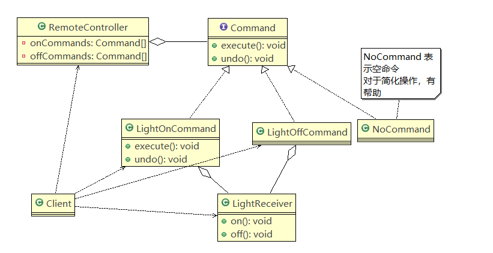

# 设计模式之命令模式

## 定义

命令模式（Command Pattern）是一种数据驱动的设计模式，它属于**行为型模式**。请求以命令的形式包裹在对象中，并传给调用对象。调用对象寻找可以处理该命令的合适的对象，并把该命令传给相应的对象，该对象执行命令。

## 释义

直接看这个定义也许会一时摸不着头脑。

**:green_book:看个例子：**

将军要给士兵发送命令去做某件事情，你会怎么做这个代码，

你可能会在**将军类**里**组合**个**士兵属性**，直接**调用士兵的方法**，

仔细思考:heavy_minus_sign:

最大的问题是**将军**和**士兵**紧**耦合**了，另外，这样将军的命令也许不是由士兵去执行，也可能是其他部门，比如文艺部，比如后勤部门等等。这样又该怎么做呢，你也许会想到 抽象出一接口，组合进将军类，需要时，再动态传入接口的实现类，恭喜你，！成功掌握了**策略模式**

这里还是存在一个问题，

你组合比如士兵接口，到时是传入后勤兵、还是作战兵，那都随便， 但也只能传`兵`

将军如果想给不属于**兵**的发号命令呢，这就办不了了。

----

仔细思考现在的情况，最大的问题是：**将军**始终和**兵**耦合在一起。策略模式解决代问题是：**动态传入具体兵**

而现在的问题是：**将军只知道发号命令，不知道是这个命令该由谁去执行，这就好比把所有人放广场上，将军号一声，拿纸来，就有人拿纸;拿刀来，就有人把刀拿来;拿鸡肉来，就有人拿肉来。**

这下已经较为明了，三个对象：将军、命令、（拿x来）、执行者（具体执行命令的人）

命令模式很好理解，举个例子，司令员下令让士兵去干件事情，从整个事情的角度来考虑，司令员的作用是，发出口令，口令经过传递，传到了士兵耳朵里，士兵去执行。这个过程好在，三者相互解耦，任何一方都不用去依赖其他人，只需要做好自己的事儿就行，司令员要的是结果，不会去关注到底士兵是怎么实现的。我们看看关系图：

## 类图



---


----

## 示例

我们总是面向接口编程，这里我们举个新例子，两相映照将军与士兵，我们这里就举

**遥控器控制智能设备，比如电视、电灯等**

首先当然是定义一个**命令**接口，结合前面我们说过的，由谁来执行这个命令，那是实现类的事。


```java
//创建命令接口,接口都是较为抽象的
public interface Command {

	//执行动作(操作)
	public void execute();
	//撤销动作(操作)
	public void undo();
}
```


这是个**关灯命令**，

```java
public class LightOffCommand implements Command {

	// 聚合LightReceiver

	LightReceiver light;

	// 构造器
	public LightOffCommand(LightReceiver light) {
			super();
			this.light = light;
		}

	@Override
	public void execute() {
		// TODO Auto-generated method stub
		// 调用接收者的方法
		light.off();
	}

	@Override
	public void undo() {
		// TODO Auto-generated method stub
		// 调用接收者的方法
		light.on();
	}
}
```

这是个**开灯命令**

```java

public class LightOnCommand implements Command {

	//聚合LightReceiver
	
	LightReceiver light;
	
	//构造器
	public LightOnCommand(LightReceiver light) {
		super();
		this.light = light;
	}
	
	@Override
	public void execute() {
		// TODO Auto-generated method stub
		//调用接收者的方法
		light.on();
	}

	

	@Override
	public void undo() {
		// TODO Auto-generated method stub
		//调用接收者的方法
		light.off();
	}

}
```


由代码也看的到，具体执行命令的是`LightReceiver`

```java
public class LightReceiver {

	public void on() {
		System.out.println(" 电灯打开了.. ");
	}
	
	public void off() {
		System.out.println(" 电灯关闭了.. ");
	}
}
```

----

我们再写个代码例子，遥控器还能开电视机，相当于**将军发的命令**，除了**兵**，实际执行的可能也是**平民**

```java
public class TVReceiver {
	
	public void on() {
		System.out.println(" 电视机打开了.. ");
	}
	
	public void off() {
		System.out.println(" 电视机关闭了.. ");
	}
}
```


----

```java
public class TVOnCommand implements Command {

	// 聚合TVReceiver

	TVReceiver tv;

	// 构造器
	public TVOnCommand(TVReceiver tv) {
		super();
		this.tv = tv;
	}

	@Override
	public void execute() {
		// TODO Auto-generated method stub
		// 调用接收者的方法
		tv.on();
	}

	@Override
	public void undo() {
		// TODO Auto-generated method stub
		// 调用接收者的方法
		tv.off();
	}
}
```


```java

public class TVOffCommand implements Command {

	// 聚合TVReceiver

	TVReceiver tv;

	// 构造器
	public TVOffCommand(TVReceiver tv) {
		super();
		this.tv = tv;
	}

	@Override
	public void execute() {
		// TODO Auto-generated method stub
		// 调用接收者的方法
		tv.off();
	}

	@Override
	public void undo() {
		// TODO Auto-generated method stub
		// 调用接收者的方法
		tv.on();
	}
}
```

下面这段代码，显然是没有任何命令

```java
/**
 * 没有任何命令，即空执行: 用于初始化每个按钮, 当调用空命令时，对象什么都不做
 * 其实，这样是一种设计模式, 可以省掉对空判断
 * @author Administrator
 *
 */
public class NoCommand implements Command {

	@Override
	public void execute() {
		// TODO Auto-generated method stub
		
	}

	@Override
	public void undo() {
		// TODO Auto-generated method stub
		
	}

}
```

---

现在终于轮到我们的遥控器上场了

```java
public class RemoteController {

	// 开 按钮的命令数组
	Command[] onCommands;
	Command[] offCommands;

	// 执行撤销的命令
	Command undoCommand;

	// 构造器，完成对按钮初始化

	public RemoteController() {

		onCommands = new Command[5];
		offCommands = new Command[5];

		for (int i = 0; i < 5; i++) {
			onCommands[i] = new NoCommand();
			offCommands[i] = new NoCommand();
		}
	}

	// 给我们的按钮设置你需要的命令
	public void setCommand(int no, Command onCommand, Command offCommand) {
		onCommands[no] = onCommand;
		offCommands[no] = offCommand;
	}

	// 按下开按钮
	public void onButtonWasPushed(int no) { // no 0
		// 找到你按下的开的按钮， 并调用对应方法
		onCommands[no].execute();
		// 记录这次的操作，用于撤销
		undoCommand = onCommands[no];

	}

	// 按下开按钮
	public void offButtonWasPushed(int no) { // no 0
		// 找到你按下的关的按钮， 并调用对应方法
		offCommands[no].execute();
		// 记录这次的操作，用于撤销
		undoCommand = offCommands[no];

	}
	
	// 按下撤销按钮
	public void undoButtonWasPushed() {
		undoCommand.undo();
	}

}
```


---

测试类：

```java
public class Client {

	public static void main(String[] args) {
		
		//使用命令设计模式，完成通过遥控器，对电灯的操作
		
		//创建电灯的对象(接受者)
		LightReceiver lightReceiver = new LightReceiver();
		
		//创建电灯相关的开关命令
		LightOnCommand lightOnCommand = new LightOnCommand(lightReceiver);
		LightOffCommand lightOffCommand = new LightOffCommand(lightReceiver);
		
		//需要一个遥控器
		RemoteController remoteController = new RemoteController();
		
		//给我们的遥控器设置命令, 比如 no = 0 是电灯的开和关的操作
		remoteController.setCommand(0, lightOnCommand, lightOffCommand);
		
		System.out.println("--------按下灯的开按钮-----------");
		remoteController.onButtonWasPushed(0);
		System.out.println("--------按下灯的关按钮-----------");
		remoteController.offButtonWasPushed(0);
		System.out.println("--------按下撤销按钮-----------");
		remoteController.undoButtonWasPushed();
		
		
		System.out.println("=========使用遥控器操作电视机==========");
		
		TVReceiver tvReceiver = new TVReceiver();
		
		TVOffCommand tvOffCommand = new TVOffCommand(tvReceiver);
		TVOnCommand tvOnCommand = new TVOnCommand(tvReceiver);
		
		//给我们的遥控器设置命令, 比如 no = 1 是电视机的开和关的操作
		remoteController.setCommand(1, tvOnCommand, tvOffCommand);
		
		System.out.println("--------按下电视机的开按钮-----------");
		remoteController.onButtonWasPushed(1);
		System.out.println("--------按下电视机的关按钮-----------");
		remoteController.offButtonWasPushed(1);
		System.out.println("--------按下撤销按钮-----------");
		remoteController.undoButtonWasPushed();

	}

}
```

----


## :heart:小结

**意图：**将一个请求封装成一个对象，从而使您可以用不同的请求对客户进行参数化。

**主要解决：**在软件系统中，行为请求者与行为实现者通常是一种紧耦合的关系，但某些场合，比如需要对行为进行记录、撤销或重做、事务等处理时，这种无法抵御变化的紧耦合的设计就不太合适。

**何时使用：**在某些场合，比如要对行为进行"记录、撤销/重做、事务"等处理，这种无法抵御变化的紧耦合是不合适的。在这种情况下，如何将"行为请求者"与"行为实现者"解耦？将一组行为抽象为对象，可以实现二者之间的松耦合。

**如何解决：**通过调用者调用接受者执行命令，顺序：调用者→接受者→命令。

**关键代码：**定义三个角色：1、received 真正的命令执行对象 2、Command 3、invoker 使用命令对象的入口

**应用实例：**struts 1 中的 action 核心控制器 ActionServlet 只有一个，相当于 Invoker，而模型层的类会随着不同的应用有不同的模型类，相当于具体的 Command。

**优点：** 1、降低了系统耦合度。 2、新的命令可以很容易添加到系统中去。

**缺点：**使用命令模式可能会导致某些系统有过多的具体命令类。

**使用场景：**认为是命令的地方都可以使用命令模式，比如： 1、GUI 中每一个按钮都是一条命令。 2、模拟 CMD。

**注意事项：**系统需要支持命令的撤销(Undo)操作和恢复(Redo)操作，也可以考虑使用命令模式，见命令模式的扩展。

## :couple_with_heart:参考与感谢

[菜鸟教程-命令模式](https://www.runoob.com/design-pattern/command-pattern.html)