# JVM相关

## 一、虚拟机栈


## 二、JMM，java内存模型

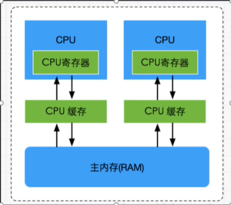

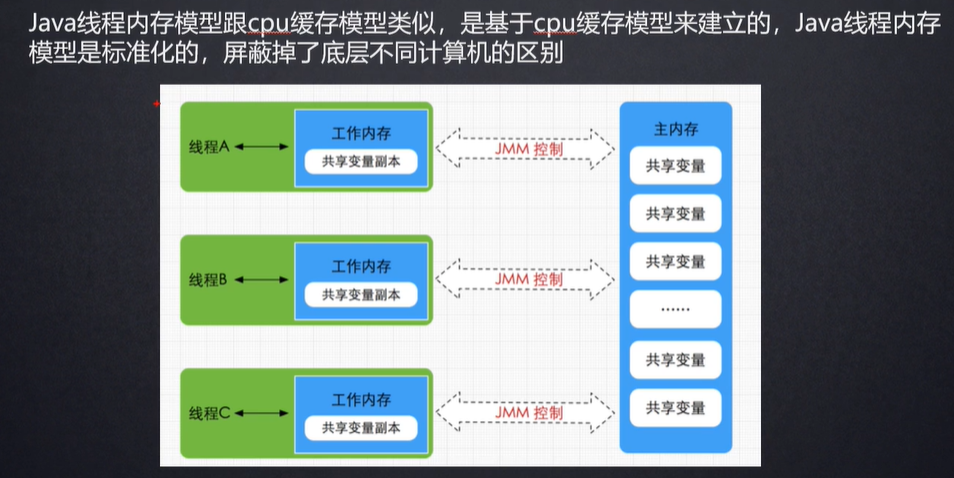

**volatile关键字**

```java
public class JMM {
    private static boolean initFlag = false;

    public static void main(String[] args) throws InterruptedException {
        new Thread(() -> {
            System.out.println("waiting data...");
            while (!initFlag) {
            }
            System.out.println("=========success");

        }).start();
        Thread.sleep(2000);
        new Thread(() -> prepareData()).start();
    }

    public static void prepareData() {
        System.out.println("preparing data ...");
        initFlag = true;
        System.out.println("preparing data end ...");
    }
}
```

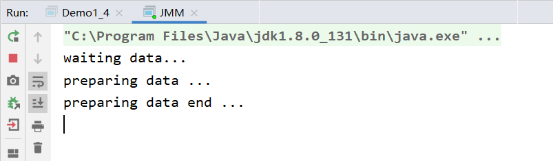

为initFlag加入volatile关键字

```java
private static volatile boolean initFlag = false;
```

**volatile保证可见性不保证原子性**

原理：

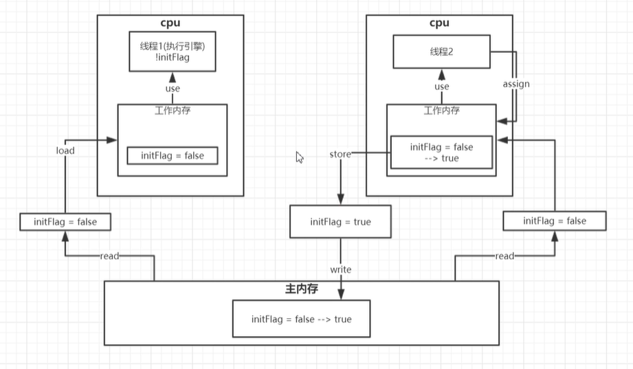

线程1中的值依旧是false。

## 三、字节码


使用`javap -verbose`命令分析一个字节码文件时，将会分析该字节码文件的魔数、版本号、常量池、类信息、类的构造方法、类中的方法信息、类变量与成员变量等信息。

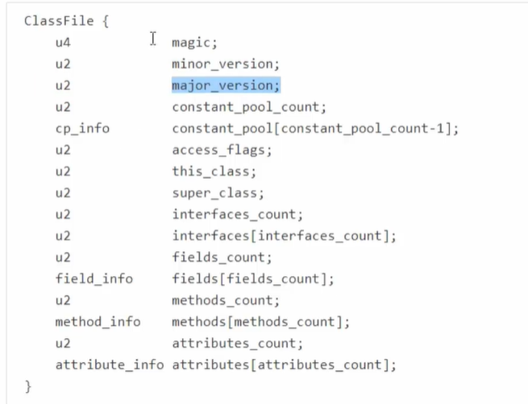

1. 魔数：所有的.class字节码文件的前4个字节都是魔数，魔数为固定值：0xCAFEBABE

2. 魔数之后的四个字节为版本信息，前两个字节表示`minor version(次版本号)`，后两个字节表示major version(主版本号)。这里的版本号为00 00 00 34，换算成十进制，表示次版本号为0

3. 常量池（constant pool)：紧接着主版本号之后的就是常量池入口

   * 一个Java类中定义的很多信息都是由常量池来维护和描述的，可以将常量池看作是Class文件的资源仓库，比如说Java类中定义的方法与变量信息，都是存储在常量池。常量池中主要存储两类常量：字面量和符号引用。字面量如文本字符串，java中声明为final的常量值等，而符号引用如类和接口的全局限定名，字段的名称和描述符，方法的名称和描述等。

4. 常量池的总体结构：Java类所对应的常量池主要由常量池数量与常量池数组这两部分共同构成，常量池数量紧跟在主版本号后面，占据2个字节，常量池数组则紧跟在常量池数量之后。常量池数组与一般的数组不同的是，常量池数组不同的元素类型、结构都是不同的，长度当然也就不同;但是，每一种元素的第一个数据都是U1类型，该字节是个标志位，占据1个字节，JVM在解析常量池时，会根据这个U1类型来获取元素的具体类型。值得注意的是，常量池数组中元素的个数=常量池数-1，（其中0暂时不使用），目的是满足某些常量池索引值的数据在特定情况下需要表达【不引用任何一个常量池】的含义;根据原因在于，索引为0也是一个常量（保留常量），只不过它不位于常量表中 ，这个常量就是对应null值，所以，常量池的索引从1而非0开始。

   在JVM规范中，每个变量/字段都有描述信息，描述信息主要的作用是描述字段的数据类型、方法的参数列表（包括数量、类型与顺序）与返回值。根据描述符规则，基本数据类型和代表无返回值的void类型都用一个大写字符来表示，对象类型则使用字符L加对象的全限定名称来表示。为了压缩字节码文件的体积，对于基本数据类型，JVM只使用一个大写字母来表示。如下所示：B -byte,

   C- char，D- double，F - float，I -int，J -long, S -short, Z -boolean, V- void ,L - 对象类型，

   如Ljava/lang/String。

5. 对于数组类型，每一个纬度使用一个前置的[来表示，如int[]被记录为[I，String[] []被记录为[[L/java/lang/String，
6. 用描述符描述方法时，按照先参数列表， 后返回值的顺序来描述。参数列表按照参数的严格顺序放在一组（）之内，如方法：String getRealnamebyIdAndNickname(int id,String name)的描述符为：（I,Ljava/lang/String;)Ljava/lang/String;

## 四、垃圾回收

### 一、引用计数法

* 无法解决循环引用的问题

### 二、可达性分析法

* GC Root根对象：使用Eclipse Memory Analyzer可以对内存进行分析，也可以查看**根对象**

### 三、四种引用（难点）

强引用、弱引用、虚引用、软引用

### 四、垃圾回收算法

#### 1、标记清除算法

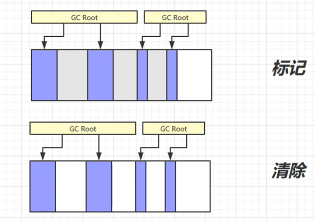

效率高、会产生内存碎片

#### 2、标记整理算法（标记-清除-压缩）

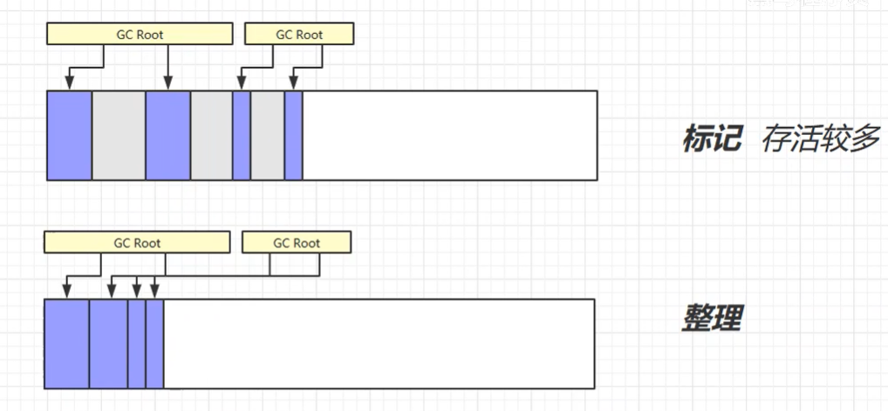

效率较低，多了一步压缩。

#### 3、复制算法

**垃圾回收有交换、谁空谁是to！**

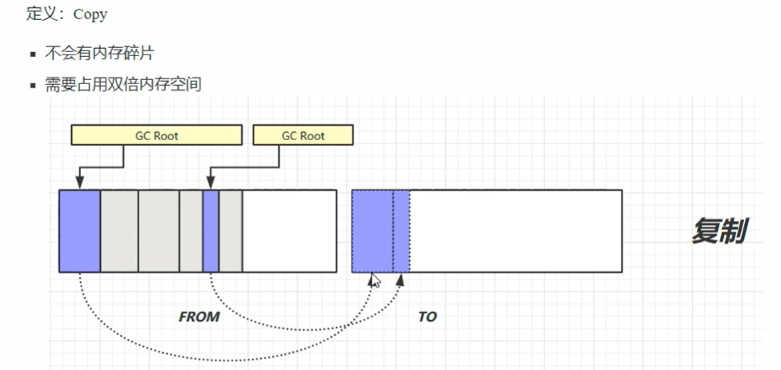

#### 4、分代收集算法

新生代：复制算法

老年代：标记整理算法

#### 5、GC参数

| 堆初始大小         | -Xms<br/>                                                    |
| ------------------ | ------------------------------------------------------------ |
| 堆最大大小         | -Xmx 或 -XX:MaxHeapSize=size<br/>                            |
| 新生代大小         | -Xmn 或 (-XX:NewSize=size + -XX:MaxNewSize=size )<br/>       |
| 幸存区比例（动态） | -XX:InitialSurvivorRatio=ratio 和 -XX:+UseAdaptiveSizePolicy<br/> |
| 幸存区比例         | -XX:SurvivorRatio=ratio<br/>                                 |
| 晋升阈值           | -XX:MaxTenuringThreshold=threshold<br/>                      |
| 晋升详情           | -XX:+PrintTenuringDistribution<br/>                          |
| GC详情             | -XX:+PrintGCDetails -verbose:gc<br/>                         |
| FullGC 前 MinorGC  | -XX:+ScavengeBeforeFullGC                                    |

#### 6、垃圾回收器

1. 串行
   * 单线程
   * 堆内存较小，适合个人电脑
2. 吞吐量优先
   * 多线程
   * 堆内存较大，多核CPU
   * 让单位时间内，STW的时间最短
3. 响应时间优先
   * 多线程
   * 堆内存较大，多核CPU
   * 尽可能让单次STW的时间最短


**串行**

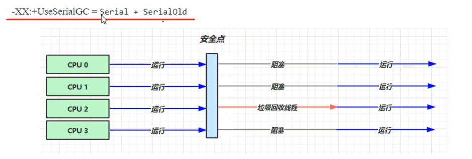

**吞吐量优先**

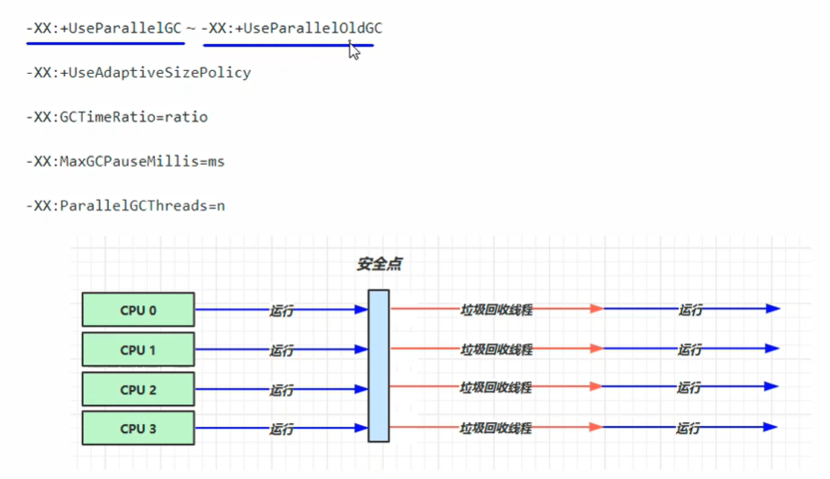

**响应时间优先**

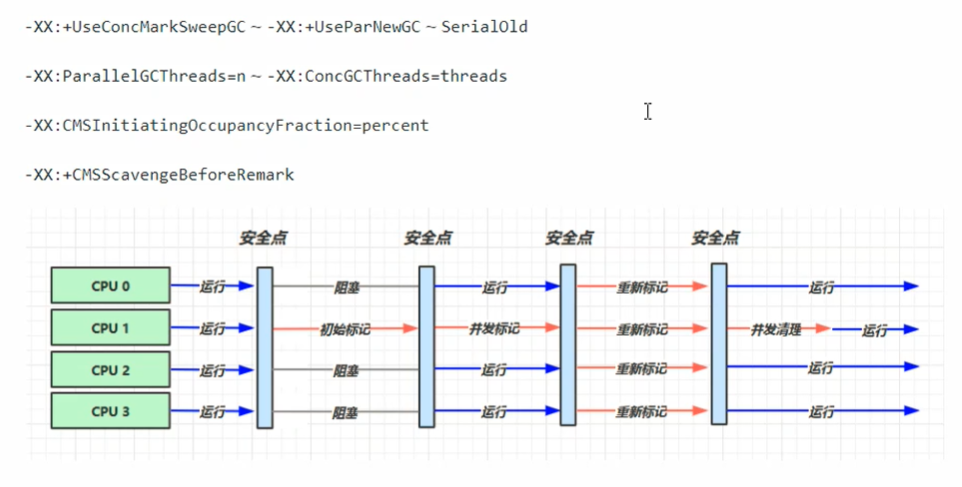

即CMS垃圾回收器


**G1垃圾回收器**

定义：Garbage First 

* 2004 论文发布 

* 2009 JDK 6u14 体验 

* 2012 JDK 7u4 官方支持 

* 2017 JDK 9 默认

  

适用场景

* 同时注重吞吐量（Throughput）和低延迟（Low latency），默认的暂停目标是 200 ms 

* 超大堆内存，会将堆划分为多个大小相等的 Region 

* 整体上是 标记+整理 算法，两个区域之间是 复制 算法

相关 JVM 参数
-XX:+UseG1GC
-XX:G1HeapRegionSize=size
-XX:MaxGCPauseMillis=time

##### G1垃圾回收阶段

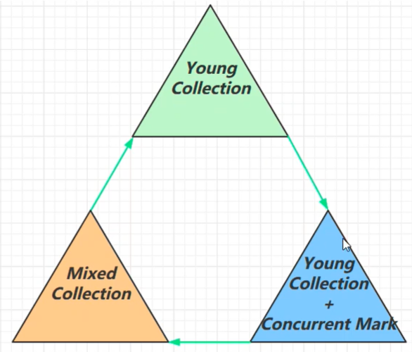

##### Young Collection

#####  Young Collection + CM 

#####  Mixed Collection 

#### FULL GC

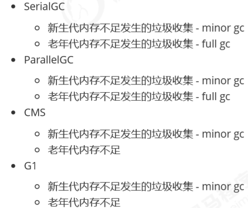

不同垃圾回收器中的Full GC不同

#### 7、GC调优

## 五、类加载

