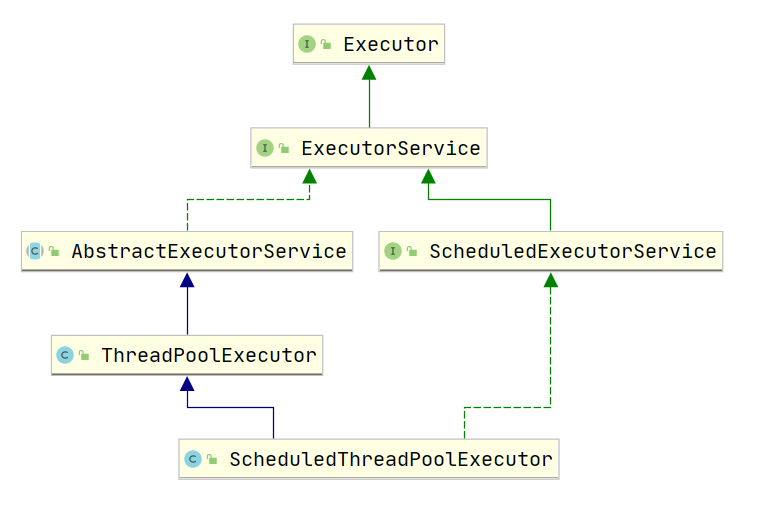

# Java线程池解析(二)


> :notebook_with_decorative_cover:上一篇文章介绍了线程池的基础知识，这节将更加深入;对于上一篇重复过的知识，这里不再赘述！

## 

## :athletic_shoe: ThreadPoolExecutor

再看继承结构：



---

## 线程池状态

上一节中已经阐述了线程池的**五种状态**

这对应于源码中的：

```java
    
private final AtomicInteger ctl = new AtomicInteger(ctlOf(RUNNING, 0));
private static final int COUNT_BITS = Integer.SIZE - 3;      // 29
private static final int CAPACITY   = (1 << COUNT_BITS) - 1; // 00011111 ... ... 11111111

// 状态在高位存储：RUNNING算起来较复杂，注意负数的补码=反码+1
private static final int RUNNING    = -1 << COUNT_BITS;      // 11100000 ... ... 00000000
private static final int SHUTDOWN   =  0 << COUNT_BITS;      // 00000000 ... ... 00000000
private static final int STOP       =  1 << COUNT_BITS;      // 00100000 ... ... 00000000
private static final int TIDYING    =  2 << COUNT_BITS;      // 01000000 ... ... 00000000
private static final int TERMINATED =  3 << COUNT_BITS;      // 01100000 ... ... 00000000
    // Packing and unpacking ctl
    private static int runStateOf(int c)     { return c & ~CAPACITY; }
    private static int workerCountOf(int c)  { return c & CAPACITY; }
	// rs 为高 3 位代表线程池状态， wc 为低 29 位代表线程个数，ctl 是合并它们
    private static int ctlOf(int rs, int wc) { return rs | wc; }

    /*
     * Bit field accessors that don't require unpacking ctl.
     * These depend on the bit layout and on workerCount being never negative.
     */

    private static boolean runStateLessThan(int c, int s) {
        return c < s;
    }

    private static boolean runStateAtLeast(int c, int s) {
        return c >= s;
    }

    private static boolean isRunning(int c) {
        return c < SHUTDOWN;
    }
```

这是`ThreadPoolExecutor`类开头的一段代码，看起来比较吃力。

其中的位运算，这里就不做具体验证了。


|   状态名   | 高 3位 | 接收新任务 | 处理阻塞队列任务 |                   说明                    |
| :--------: | :----: | :--------: | :--------------: | :---------------------------------------: |
|  RUNNING   |  111   |     Y      |        Y         |                                           |
|  SHUTDOWN  |  000   |     N      |        Y         | 不会接收新任务，但会处理阻塞队列剩余任务  |
|    STOP    |  001   |     N      |        N         | 会中断正在执行的任务，并抛弃阻塞队列任务  |
|  TIDYING   |  010   |     -      |        -         | 任务全执行完毕，活动线程为 0 即将进入终结 |
| TERMINATED |  011   |     -      |        -         |                 终结状态                  |

从数字上比较**，TERMINATED > TIDYING > STOP > SHUTDOWN > RUNNING**

这些信息存储在一个原子变量 `ctl` 中，目的是将**线程池状态与线程个数**合二为一，这样就可以用一次 cas 原子操作进行赋值，更容易保证**在多线程环境下保证运行状态和线程数量的统一**。

都是大师的智慧啊

---

## :fire_engine:拒绝策略

`JDK`提供了4种拒绝策略的实现，其他框架也提供了实现。

- **AbortPolicy(抛出一个异常，默认的)**
- **DiscardPolicy(直接丢弃任务)**
- **DiscardOldestPolicy（丢弃队列里最老的任务，将当前这个任务继续提交给线程池）**
- **CallerRunsPolicy（交给线程池调用所在的线程进行处理)**
- Dubbo 的实现，在抛出 RejectedExecutionException 异常之前会记录日志，并 dump 线程栈信息，方
  便定位问题
- Netty 的实现，是创建一个新线程来执行任务
- ActiveMQ 的实现，带超时等待（60s）尝试放入队列，类似我们之前自定义的拒绝策略
- PinPoint 的实现，它使用了一个拒绝策略链，会逐一尝试策略链中每种拒绝策略

**例如：**`AbortPolicy`

```java
    public static class AbortPolicy implements RejectedExecutionHandler {
        /**
         * Creates an {@code AbortPolicy}.
         */
        public AbortPolicy() { }

        /**
         * Always throws RejectedExecutionException.
         *
         * @param r the runnable task requested to be executed
         * @param e the executor attempting to execute this task
         * @throws RejectedExecutionException always
         */
        public void rejectedExecution(Runnable r, ThreadPoolExecutor e) {
            throw new RejectedExecutionException("Task " + r.toString() +
                                                 " rejected from " +
                                                 e.toString());
        }
    }
```

其他可自行参阅`ThreadPoolExecutor`类

---

## 浅谈：newSingleThreadExecutor

上一篇文章中，我们简单的介绍过`newSingleThreadExecutor`

这是JDK为我们内置的一个单线程的线程池

通过`Executors`工具类来创建

```java
    public static ExecutorService newSingleThreadExecutor(ThreadFactory threadFactory) {
        return new FinalizableDelegatedExecutorService
            (new ThreadPoolExecutor(1, 1,
                                    0L, TimeUnit.MILLISECONDS,
                                    new LinkedBlockingQueue<Runnable>(),
                                    threadFactory));
    }
```

:question:<font color='red'>为啥返回的是`FinalizableDelegatedExecutorService`类呢？？？</font>

考虑这样一个问题：

创建一个单线程的线程池与`Executors.newFixedThreadPool(1)`有什么区别呢？

:angel:

返回的`FinalizableDelegatedExecutorService`

```java
    static class FinalizableDelegatedExecutorService
        extends DelegatedExecutorService {
        FinalizableDelegatedExecutorService(ExecutorService executor) {
            super(executor);
        }
        protected void finalize() {
            super.shutdown();
        }
    }
//继承自DelegatedExecutorService

    static class DelegatedExecutorService extends AbstractExecutorService {
        //持有一个线程池的引用
        private final ExecutorService e;
        DelegatedExecutorService(ExecutorService executor) { e = executor; }
        //可以看到调用的都是ExecutorService中的方法
        public void execute(Runnable command) { e.execute(command); }
        public void shutdown() { e.shutdown(); }
        public List<Runnable> shutdownNow() { return e.shutdownNow(); }
        public boolean isShutdown() { return e.isShutdown(); }
        public boolean isTerminated() { return e.isTerminated(); }
        public boolean awaitTermination(long timeout, TimeUnit unit)
            throws InterruptedException {
            return e.awaitTermination(timeout, unit);
        }
        public Future<?> submit(Runnable task) {
            return e.submit(task);
        }
        public <T> Future<T> submit(Callable<T> task) {
            return e.submit(task);
        }
        public <T> Future<T> submit(Runnable task, T result) {
            return e.submit(task, result);
        }
        public <T> List<Future<T>> invokeAll(Collection<? extends Callable<T>> tasks)
            throws InterruptedException {
            return e.invokeAll(tasks);
        }
        public <T> List<Future<T>> invokeAll(Collection<? extends Callable<T>> tasks,
                                             long timeout, TimeUnit unit)
            throws InterruptedException {
            return e.invokeAll(tasks, timeout, unit);
        }
        public <T> T invokeAny(Collection<? extends Callable<T>> tasks)
            throws InterruptedException, ExecutionException {
            return e.invokeAny(tasks);
        }
        public <T> T invokeAny(Collection<? extends Callable<T>> tasks,
                               long timeout, TimeUnit unit)
            throws InterruptedException, ExecutionException, TimeoutException {
            return e.invokeAny(tasks, timeout, unit);
        }
    }
```

这里可以看出， 这是一个典型的`装饰者设计模式`

其作用：其返回的`FinalizableDelegatedExecutorService`类，只能调用部分方法，即上图中的方法，

但`newFixedThreadPool`返回的是ThreadPoolExecutor类。对比下就可以发现方法的数量不同。

**比如**：如果是`Executors.newFixedThreadPool(1)`

我们可以调用java.util.concurrent.ThreadPoolExecutor#setCorePoolSize这个方法改变线程池中线程的数量。

但是`newSingleThreadExecutor`没有这个方法，就保证了线程数量不会变更改。

:question:<font color='red'>既然是单个线程的线程池，为什么我们不走代码中直接创建一个新线程来执行任务呢，不也是串行的么？</font>

**答：**自己创建一个单线程串行执行任务，如果任务执行失败而终止那么没有任何补救措施，而线程池还会新建一
个线程，保证池的正常工作

这里可以参考链接：

**[一个线程池中的线程异常了，那么线程池会怎么处理这个线程?](https://www.jianshu.com/p/40e8f4ccc796)**


---

## 线程池异常处理

在使用线程池处理任务的时候，任务代码可能抛出RuntimeException，抛出异常后，线程池可能捕获它，也可能创建一个新的线程来代替异常的线程，我们可能无法感知任务出现了异常，因此我们需要考虑线程池异常情况。

### 当提交新任务时，异常如何处理?

我们先来看一段代码：使用`submit`方法提交任务

```java
       ExecutorService threadPool = Executors.newFixedThreadPool(5);
        for (int i = 0; i < 5; i++) {
            threadPool.submit(() -> {
                System.out.println("current thread name" + Thread.currentThread().getName());
                Object object = null;
                System.out.print("result## "+object.toString());
            });
        }

```

显然，这段代码会有异常，我们再来看看执行结果


.assets/16bee347085e360b)

核心线程不会销毁，所以虚拟机进程不会销毁

虽然没有结果输出，但是没有抛出异常，所以我们无法感知任务出现了异常

所以需要添加try/catch。 如下图：

.assets/16bee41a1dfeef91)

OK，线程的异常处理，**我们可以直接try...catch捕获。**

这相当于我们手动在**任务中**进行了异常处理

### 线程池exec.submit(runnable)的执行流程

通过debug上面有异常的submit方法（**建议大家也去debug看一下,图上的每个方法内部是我打断点的地方**），处理有异常submit方法的主要执行流程图：


.assets/16bef895fec0d45b)


```java
  //构造feature对象
  /**
     * @throws RejectedExecutionException {@inheritDoc}
     * @throws NullPointerException       {@inheritDoc}
     */
    public Future<?> submit(Runnable task) {
        if (task == null) throw new NullPointerException();
        RunnableFuture<Void> ftask = newTaskFor(task, null);
        execute(ftask);
        return ftask;
    }
     protected <T> RunnableFuture<T> newTaskFor(Runnable runnable, T value) {
        return new FutureTask<T>(runnable, value);
    }
     public FutureTask(Runnable runnable, V result) {
        this.callable = Executors.callable(runnable, result);
        this.state = NEW;       // ensure visibility of callable
    }
       public static <T> Callable<T> callable(Runnable task, T result) {
        if (task == null)
            throw new NullPointerException();
        return new RunnableAdapter<T>(task, result);
    }
    //线程池执行
     public void execute(Runnable command) {
        if (command == null)
            throw new NullPointerException();
               int c = ctl.get();
        if (workerCountOf(c) < corePoolSize) {
            if (addWorker(command, true))
                return;
            c = ctl.get();
        }
        if (isRunning(c) && workQueue.offer(command)) {
            int recheck = ctl.get();
            if (! isRunning(recheck) && remove(command))
                reject(command);
            else if (workerCountOf(recheck) == 0)
                addWorker(null, false);
        }
        else if (!addWorker(command, false))
            reject(command);
    }
    //捕获异常
    public void run() {
        if (state != NEW ||
            !UNSAFE.compareAndSwapObject(this, runnerOffset,
                                         null, Thread.currentThread()))
            return;
        try {
            Callable<V> c = callable;
            if (c != null && state == NEW) {
                V result;
                boolean ran;
                try {
                    result = c.call();
                    ran = true;
                } catch (Throwable ex) {
                    result = null;
                    ran = false;
                    setException(ex);
                }
                if (ran)
                    set(result);
            }
        } finally {
            // runner must be non-null until state is settled to
            // prevent concurrent calls to run()
            runner = null;
            // state must be re-read after nulling runner to prevent
            // leaked interrupts
            int s = state;
            if (s >= INTERRUPTING)
                handlePossibleCancellationInterrupt(s);
        }
```

通过以上分析，**submit执行的任务，可以通过Future对象的get方法接收抛出的异常，再进行处理。** 我们再通过一个demo，看一下Future对象的get方法处理异常的姿势，如下图：


.assets/16bef9bb609bbe31)


### 其他两种处理线程池异常方案

除了以上**1.在任务代码try/catch捕获异常，2.通过Future对象的get方法接收抛出的异常，再处理**两种方案外，还有以上两种方案：

#### 3.为工作者线程设置UncaughtExceptionHandler，在uncaughtException方法中处理异常

我们直接看这样实现的正确姿势：

```java
ExecutorService threadPool = Executors.newFixedThreadPool(1, r -> {
            Thread t = new Thread(r);
            t.setUncaughtExceptionHandler(
                    (t1, e) -> {
                        System.out.println(t1.getName() + "线程抛出的异常"+e);
                    });
            return t;
           });
        threadPool.execute(()->{
            Object object = null;
            System.out.print("result## " + object.toString());
        });
```

运行结果：

.assets/16bf00f61b40c749)


#### 4.重写ThreadPoolExecutor的afterExecute方法，处理传递的异常引用

这是jdk文档的一个demo：

```java
class ExtendedExecutor extends ThreadPoolExecutor {
    // 这可是jdk文档里面给的例子。。
    protected void afterExecute(Runnable r, Throwable t) {
        super.afterExecute(r, t);
        if (t == null && r instanceof Future<?>) {
            try {
                Object result = ((Future<?>) r).get();
            } catch (CancellationException ce) {
                t = ce;
            } catch (ExecutionException ee) {
                t = ee.getCause();
            } catch (InterruptedException ie) {
                Thread.currentThread().interrupt(); // ignore/reset
            }
        }
        if (t != null)
            System.out.println(t);
    }
}}
```

### 因此，被问到线程池异常处理，如何回答？


.assets/16bec33ca5559c93-1581247684719)

---

