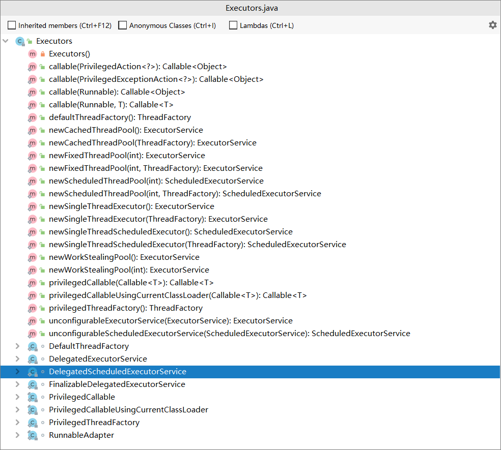

# Java线程池解析


> :blue_heart:Java线程池是java面试中的重点内容，需要深刻理解掌握。
>
> 这里是对我Java线程池内容的总洁


## :arrow_right: 经点面试题

- **面试问题1：Java的线程池说一下，各个参数的作用，如何进行的?**
- **面试问题2：按线程池内部机制，当提交新任务时，有哪些异常要考虑。**
- **面试问题3：线程池都有哪几种工作队列？**
- **面试问题4：使用无界队列的线程池会导致内存飙升吗？**
- **面试问题5：说说几种常见的线程池及使用场景?**

---

## 为什么需要线程池？

随着cpu核数越来越多，不可避免的利用多线程技术以充分利用其计算能力。所以，多线程技术是服务端开发人员必须掌握的技术。

**线程的创建和销毁，都涉及到系统调用，比较消耗系统资源**，所以就引入了线程池技术，避免频繁的线程创建和销毁

---

## :star2: 线程池的创建

先看一下**ThreadPoolExecutor**参数最全的构造方法：

```java
    public ThreadPoolExecutor(int corePoolSize,
                              int maximumPoolSize,
                              long keepAliveTime,
                              TimeUnit unit,
                              BlockingQueue<Runnable> workQueue,
                              ThreadFactory threadFactory,
                              RejectedExecutionHandler handler) {
```


- **corePoolSize：**线程池的核心线程数，说白了就是，即便是线程池里没有任何任务，也会有corePoolSize个线程在候着等任务。
- **maximumPoolSize：**最大线程数，不管你提交多少任务，线程池里最多工作线程数就是maximumPoolSize。
- **keepAliveTime：**线程的存活时间。当线程池里的线程数大于corePoolSize时，如果等了keepAliveTime时长还没有任务可执行，则线程退出。
- **unit：**这个用来指定keepAliveTime的单位，比如秒:TimeUnit.SECONDS。
- **workQueue：**一个阻塞队列，提交的任务将会被放到这个队列里。
- **threadFactory：**新的线程由`ThreadFactory`创建，默认使用`Executors.defaultThreadFactory()`，创建出来的线程都在同一个线程组，拥有同样的`NORM_PRIORITY`优先级并且都不是守护线程。如果自己指定`ThreadFactory`，那么就可以改变线程名、线程组、优先级、是否是守护线程等。通常情况下直接使用`defaultThreadFactory`就行。
- **handler：**拒绝策略，当线程池里线程被耗尽，且队列也满了的时候会调用。

<font color='green'><strong>这非常重要</strong></font>

## :fire: 线程池的执行流程

这里用一个图来说明线程池的执行流程


- 提交一个任务，线程池里存活的核心线程数小于线程数corePoolSize时，线程池会创建一个核心线程去处理提交的任务。
- 如果线程池核心线程数已满，即线程数已经等于corePoolSize，一个新提交的任务，会被放进任务队列workQueue排队等待执行。
- 当线程池里面存活的线程数已经等于corePoolSize了,并且任务队列workQueue也满，判断线程数是否达到maximumPoolSize，即最大线程数是否已满，如果没到达，创建一个非核心线程执行提交的任务。
- 如果当前的线程数达到了maximumPoolSize，还有新的任务过来的话，直接采用拒绝策略处理。

----

## 线程池的继承树

下图为线程池ThreadPoolExecutor的体系结构


Executor作为java中线程池的顶级接口，有与之对应的工具类`Executors`类，这与集合的工具类`Collections`类、数组的工具类`Arrays`类是一样的。

我们来看看他有哪些方法



上图我们主要关注以new开头的几个方法，这是`Executors`工具类用来创建java提供的几个内置线程池的方法。


> #### 线程池应该手动创建还是自动创建？
>
> > 手动创建更好，因为这样可以让我们更加了解线程池的运行规则，避免资源耗尽的风险。


---

## :boxing_glove: 使用内置线程池的相关问题

### 几种常用的线程池

- **newFixedThreadPool (固定数目线程的线程池)**
- **newCachedThreadPool(可缓存线程的线程池)**
- **newSingleThreadExecutor(单线程的线程池)**
- **newScheduledThreadPool(定时及周期执行的线程池)**

### newFixedThreadPool

```java
  public static ExecutorService newFixedThreadPool(int nThreads, ThreadFactory threadFactory) {
        return new ThreadPoolExecutor(nThreads, nThreads,
                                      0L, TimeUnit.MILLISECONDS,
                                      new LinkedBlockingQueue<Runnable>(),
                                      threadFactory);
    }
```

#### 线程池特点：

- 核心线程数和最大线程数大小一样
- 没有所谓的非空闲时间，即keepAliveTime为0
- 阻塞队列为无界队列LinkedBlockingQueue
- :fist_right:<font color='red'>当处理任务的速度赶不上任务提交的速度的时候，就可能会让大量任务堆积在`workQueue`中，从而引发`OOM`异常</font>

#### 工作机制：


- 提交任务
- 如果线程数少于核心线程，创建核心线程执行任务
- 如果线程数等于核心线程，把任务添加到LinkedBlockingQueue阻塞队列
- 如果线程执行完任务，去阻塞队列取任务，继续执行。

#### 实例代码

```java
   ExecutorService executor = Executors.newFixedThreadPool(10);
                    for (int i = 0; i < Integer.MAX_VALUE; i++) {
                        executor.execute(()->{
                            try {
                                Thread.sleep(10000);
                            } catch (InterruptedException e) {
                                //do nothing
                            }
            });
```

IDE指定JVM参数：-Xmx8m -Xms8m :


run以上代码，会抛出OOM：


因此，**面试题：使用无界队列的线程池会导致内存飙升吗？**

答案 **：会的，newFixedThreadPool使用了无界的阻塞队列LinkedBlockingQueue，如果线程获取一个任务后，任务的执行时间比较长(比如，上面demo设置了10秒)，会导致队列的任务越积越多，导致机器内存使用不停飙升，** 最终导致OOM。

#### 使用场景

FixedThreadPool 适用于处理CPU密集型的任务，确保CPU在长期被工作线程使用的情况下，尽可能的少的分配线程，即适用执行长期的任务。

### newCachedThreadPool

```java
   public static ExecutorService newCachedThreadPool(ThreadFactory threadFactory) {
        return new ThreadPoolExecutor(0, Integer.MAX_VALUE,
                                      60L, TimeUnit.SECONDS,
                                      new SynchronousQueue<Runnable>(),
                                      threadFactory);
    }

```

#### 线程池特点：

- 核心线程数为0
- 最大线程数为Integer.MAX_VALUE
- 阻塞队列是SynchronousQueue
- 非核心线程空闲存活时间为60秒
- :fist_right:<font color='red'>`newCachedThreadPool`的`maxPoolSize`设置的值为`Integer.MAX_VALUE`，所以可能会导致线程被无限创建，最终导致`OOM`异常</font>

当提交任务的速度大于处理任务的速度时，每次提交一个任务，就必然会创建一个线程。极端情况下会创建过多的线程，耗尽 CPU 和内存资源。由于空闲 60 秒的线程会被终止，长时间保持空闲的 CachedThreadPool 不会占用任何资源。

#### 工作机制


- 提交任务
- 因为没有核心线程，所以任务直接加到SynchronousQueue队列。
- 判断是否有空闲线程，如果有，就去取出任务执行。
- 如果没有空闲线程，就新建一个线程执行。
- 执行完任务的线程，还可以存活60秒，如果在这期间，接到任务，可以继续活下去；否则，被销毁。

#### 实例代码

```java
  ExecutorService executor = Executors.newCachedThreadPool();
        for (int i = 0; i < 5; i++) {
            executor.execute(() -> {
                System.out.println(Thread.currentThread().getName()+"正在执行");
            });
        }

```

运行结果：


#### 使用场景

用于并发执行大量短期的小任务。

### newSingleThreadExecutor

```java
  public static ExecutorService newSingleThreadExecutor(ThreadFactory threadFactory) {
        return new FinalizableDelegatedExecutorService
            (new ThreadPoolExecutor(1, 1,
                                    0L, TimeUnit.MILLISECONDS,
                                    new LinkedBlockingQueue<Runnable>(),
                                    threadFactory));
    }

```

#### 线程池特点

- 核心线程数为1
- 最大线程数也为1
- 阻塞队列是LinkedBlockingQueue
- keepAliveTime为0
- :fist_right:<font color='red'>从源码可以看出`newSingleThreadExecutor`和`newFixedThreadPool`基本类似，不同的只是`corePoolSize`和`maxPoolSize`的值，所以`newSingleThreadExecutor`也存在内存溢出问题。</font>

#### 工作机制


- 提交任务
- 线程池是否有一条线程在，如果没有，新建线程执行任务
- 如果有，讲任务加到阻塞队列
- 当前的唯一线程，从队列取任务，执行完一个，再继续取，一个人（一条线程）夜以继日地干活。

#### 实例代码

```java
  ExecutorService executor = Executors.newSingleThreadExecutor();
                for (int i = 0; i < 5; i++) {
                    executor.execute(() -> {
                        System.out.println(Thread.currentThread().getName()+"正在执行");
                    });
        }

```

运行结果：


#### 使用场景

适用于串行执行任务的场景，一个任务一个任务地执行。

### newScheduledThreadPool

```java
    public ScheduledThreadPoolExecutor(int corePoolSize) {
        super(corePoolSize, Integer.MAX_VALUE, 0, NANOSECONDS,
              new DelayedWorkQueue());
    }

```

#### 线程池特点

- 最大线程数为Integer.MAX_VALUE
- 阻塞队列是DelayedWorkQueue
- keepAliveTime为0
- scheduleAtFixedRate() ：按某种速率周期执行
- scheduleWithFixedDelay()：在某个延迟后执行

#### 工作机制

- 添加一个任务
- 线程池中的线程从 DelayQueue 中取任务
- 线程从 DelayQueue 中获取 time 大于等于当前时间的task
- 执行完后修改这个 task 的 time 为下次被执行的时间
- 这个 task 放回DelayQueue队列中

#### 实例代码

```java
    /**
    创建一个给定初始延迟的间隔性的任务，之后的下次执行时间是上一次任务从执行到结束所需要的时间+* 给定的间隔时间
    */
    ScheduledExecutorService scheduledExecutorService = Executors.newScheduledThreadPool(1);
        scheduledExecutorService.scheduleWithFixedDelay(()->{
            System.out.println("current Time" + System.currentTimeMillis());
            System.out.println(Thread.currentThread().getName()+"正在执行");
        }, 1, 3, TimeUnit.SECONDS);

```

运行结果：


```java
    /**
    创建一个给定初始延迟的间隔性的任务，之后的每次任务执行时间为 初始延迟 + N * delay(间隔) 
    */
    ScheduledExecutorService scheduledExecutorService = Executors.newScheduledThreadPool(1);
            scheduledExecutorService.scheduleAtFixedRate(()->{
            System.out.println("current Time" + System.currentTimeMillis());
            System.out.println(Thread.currentThread().getName()+"正在执行");
        }, 1, 3, TimeUnit.SECONDS);;

```

#### 使用场景

周期性执行任务的场景，需要限制线程数量的场景


### 对比线程池的特点


- FixedThreadPool：通过手动传入`corePoolSize`和`maxPoolSize`，以固定的线程数来执行任务
- SingleThreadExecutor：`corePoolSize`和`maxPoolSize`默认都是1，全程只以1条线程执行任务
- CachedThreadPool：它没有需要维护的核心线程数，每当需要线程的时候就进行创建，因为它的线程存活时间是60秒，所以它也凭借着这个参数实现了自动回收的功能。
- ScheduledThreadPool：这个线程池可以执行定时任务，`corePoolSize`是通过手动传入的，它的`maxPoolSize`为`Integer.MAX_VALUE`，并且具有自动回收线程的功能。

#### 1) 为什么FixedThreadPool和SingleThreadExecutor的Queue是LinkedBlockingQueue？

因为这两个线程池的核心线程数和最大线程数都是相同的，也就无法预估任务量，所以需要在自身进行改进，就使用了无界队列。

#### 2)为什么CachedThreadPool使用的Queue是SynchronousQueue？

因为缓存线程池的最大线程数是“无上限”的，每当任务来的时候直接创建线程进行执行就好了，所以不需要使用队列来存储任务。这样避免了使用队列进行任务的中转，提高了执行效率。

#### 3)为什么ScheduledThreadPool使用延迟队列DelayedWorkQueue？

因为`ScheduledThreadPool`是延迟任务线程池，所以使用延迟队列有利于对执行任务的时间做延迟。

#### 4) JDK1.8中加入的workStealingPool

- `workStealingPool`适用于执行产生子任务的环境，例如进行二叉树的遍历。

- `workStealingPool`具有窃取能力。

- 使用时最好不要加锁，而且不保证执行顺序。

  

回到面试题：**说说几种常见的线程池及使用场景？**

回答这四种经典线程池 **：newFixedThreadPool，newSingleThreadExecutor，newCachedThreadPool，newScheduledThreadPool，分线程池特点，工作机制，使用场景分开描述，再分析可能存在的问题，比如newFixedThreadPool内存飙升问题** 即可

## 线程池创建多少线程合适

1. IO密集计算，如何将硬件利用率达到极致呢 我们将 R = IO耗时 / Cpu耗时 我们从上面的例子来看 如果IO耗时/Cpu耗时 = 10 （我们平常可以用工具apm来统计这个比例） 创建线程A 执行io操作 我们希望IO操作的时候 Cpu不能闲着 所以就应该创建10个线程去执行Cpu计算 当Io操作完毕后刚好Cpu也执行完毕 ，他们的利用率都是百分之100 在执行这段代码的时候。这个例子我们要创建 1+ 10 = 11个线程执行起来效率更高，于是我们就得到了公式: 1+ I/O耗时/Cpu耗时，如果是多核Cpu 最佳线程数 =CPU 核数 * [ 1 +（I/O 耗时 / Cpu 耗时）
2. Cpu密集型 这个就很简单了 Cpu的核数 = 线程数就行，一般我们会设置 Cpu核数+1 防止由于其他因素导致线程阻塞等。

参考链接：[线程池创建多少线程比较合理？](https://www.cnblogs.com/karlMa/p/11356041.html)

---


## 线程池状态

线程池有这几个状态：RUNNING,SHUTDOWN,STOP,TIDYING,TERMINATED。

```java
   //线程池状态
   private static final int RUNNING    = -1 << COUNT_BITS;
   private static final int SHUTDOWN   =  0 << COUNT_BITS;
   private static final int STOP       =  1 << COUNT_BITS;
   private static final int TIDYING    =  2 << COUNT_BITS;
   private static final int TERMINATED =  3 << COUNT_BITS;
```

### 线程池各个状态切换图：


**RUNNING**

- 该状态的线程池会接收新任务，并处理阻塞队列中的任务;
- 调用线程池的shutdown()方法，可以切换到SHUTDOWN状态;
- 调用线程池的shutdownNow()方法，可以切换到STOP状态;

**SHUTDOWN**

- 该状态的线程池不会接收新任务，但会处理阻塞队列中的任务；
- 队列为空，并且线程池中执行的任务也为空,进入TIDYING状态;

**STOP**

- 该状态的线程不会接收新任务，也不会处理阻塞队列中的任务，而且会中断正在运行的任务；
- 线程池中执行的任务为空,进入TIDYING状态;

**TIDYING**

- 该状态表明所有的任务已经运行终止，记录的任务数量为0。
- terminated()执行完毕，进入TERMINATED状态

**TERMINATED**

- 该状态表示线程池彻底终止

---

:bowing_woman: 以上是一些线程池的基础知识，下一篇将会梳理下线程池更深入一点的知识。

## :kissing: 参考与感谢

[面试必备：Java线程池解析](https://juejin.im/post/5d1882b1f265da1ba84aa676#heading-44)

[说一下线程池内部工作原理](https://www.javazhiyin.com/58408.html)

[学习线程池 掌握治理线程的法宝](https://juejin.im/post/5e1b1fcce51d454d3046a3de#heading-0)