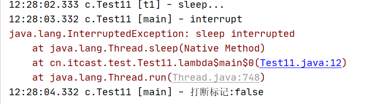

# Thread类的interrupt方法

## 一、线程中断

中断可以理解为一个线程的标志位，与线程中断有关的方法

+ **interrupt方法**

Thread类的实例方法：中断被调用线程，实际上只是改变了被调用线程 的内部中断状态，

==并不会中断线程==

必须注意API中的这一段描述

> If this thread is blocked in an invocation of the wait(), wait(long), or wait(long, int) methods of the Object class, or of the join(), join(long), join(long, int), sleep(long), or sleep(long, int), methods of this class, then its interrupt status will be cleared and it will receive an InterruptedException.

如果该线程被阻塞在的调用wait() ， wait(long) ，或者wait(long, int)的方法的Object类，或者在join() join(long) ， join(long, int) ， sleep(long) ，或sleep(long, int)这个类的方法，那么它的中断状态将被清除，它还将收到一个InterruptedException 。

* **interrupted方法**

测试该线程对象是否被中断，**会清除中断标志位**

* **isInterrupted方法**

测试该线程对象是否被中断，**不会清除中断标志位**

## 二、实例测试

### 1. 打断一个阻塞的线程，如sleep中的线程


```java
@Slf4j(topic = "c.Test11")
public class Test11 {

    public static void main(String[] args) throws InterruptedException {
        Thread t1 = new Thread(() -> {
            log.debug("sleep...");
            try {
                Thread.sleep(5000); // wait, join
            } catch (InterruptedException e) {
                e.printStackTrace();
            }
        },"t1");

        t1.start();
        Thread.sleep(1000);
        log.debug("interrupt");
        t1.interrupt();
        Thread.sleep(1000);//防止interrupt方法未执行完毕，就继续执行下一行代码
        log.debug("打断标记:{}", t1.isInterrupted());
    }
}
```





==打断了正在休眠中的线程，抛出了中断异常，打断状态为false，被重置了==

### 2、打断一个正常运行的线程

**Interrupt方法仅仅是对当前线程做了中断‘标记’，但是否真的结束线程运行，并不是由Java来完成的，需要开发者自己判断此标记，适当位置时机结束线程运行**

测试：

```java
@Slf4j(topic = "c.Test12")
public class Test12 {

    public static void main(String[] args) throws InterruptedException {
        Thread t1 = new Thread(() -> {
            while(true) {
                boolean interrupted = Thread.currentThread().isInterrupted();
                if(interrupted) {
                    log.debug("被打断了, 退出循环");
                    break;
                }
            }
        }, "t1");
        t1.start();

        Thread.sleep(1000);
        log.debug("interrupt");
        t1.interrupt();
    }
}
```

测试结果：

```java
12:32:21.718 c.Test12 [main] - interrupt
12:32:21.720 c.Test12 [t1] - 被打断了, 退出循环
```

## 三、如何正确使用Interrupt方法来中止线程


```java
@Slf4j(topic = "c.TPTInterrupt")
public class TPTInterrupt {
    private Thread thread;

    public void start() {
        thread = new Thread(() -> {
            while (true) {
                Thread current = Thread.currentThread();
                if (current.isInterrupted()) {
                    log.debug("料理后事");
                    break;
                }
                try {
                    log.debug("即将进入休眠");
                    Thread.sleep(1000);
                    log.debug("将结果保存");
                } catch (InterruptedException e) {
                    current.interrupt();
                }
// 执行监控操作
            }
        }, "监控线程");
        thread.start();
    }

    public void stop() {
        log.debug("打断线程");
        thread.interrupt();
    }

    public static void main(String[] args) throws InterruptedException {
        TPTInterrupt tptInterrupt = new TPTInterrupt();
        tptInterrupt.start();
        tptInterrupt.stop();
    }
}
```


```java
12:48:23.214 c.TPTInterrupt [main] - 打断线程
12:48:23.214 c.TPTInterrupt [监控线程] - 即将进入休眠
12:48:23.217 c.TPTInterrupt [监控线程] - 料理后事
```

**注意运行结果不是一定的**。

小结一下：线程启动后，我们执行了打断，

如果不是在

```
Thread.sleep(1000);
```

即休眠中被打断，那么中断标志位将被正常设置为true。那继续循环后将进入if中，料理后事然后退出

如果是在sleep中被打断，那么会抛出`InterruptedException`将会进入catch块中，再次进行打断（重新设置标志位）。

## 四、中断park线程


测试用例：

```java
@Slf4j(topic = "c.Test14")
public class Test14 {

    private static void test4() {
        Thread t1 = new Thread(() -> {
            for (int i = 0; i < 5; i++) {
                log.debug("park...");
                LockSupport.park();
                //如果打断标记已经是 true, 则 park 会失效，所以这里使用interrupted方法清除了中断状态
                log.debug("打断状态：{}", Thread.interrupted());
            }
        });
        t1.start();


        sleep(1);
        t1.interrupt();
    }

    private static void test3() throws InterruptedException {
        Thread t1 = new Thread(() -> {
            log.debug("park...");
            LockSupport.park();
            log.debug("unpark...");
      		// 执行了interrupt()后，中断状态设置为true
            log.debug("打断状态：{}", Thread.currentThread().isInterrupted());
        }, "t1");
        t1.start();

        sleep(1);
        t1.interrupt();

    }

    public static void main(String[] args) throws InterruptedException {
        test4();
    }
}
```

`LockSupport.park();`禁用线程，使其不被调度并处于休眠状态。

