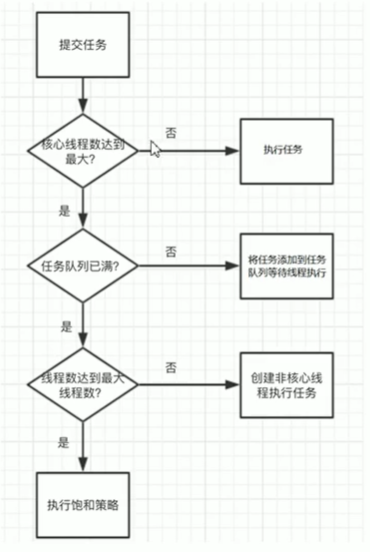
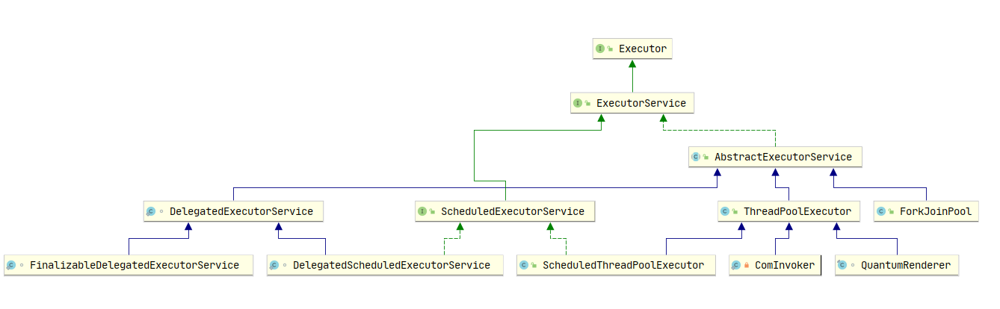

# 多线程笔记

## 一、创建多少线程比较合适

经过上面的分析，我们知道创建多少线程能够将硬件的利用率达到最高才是最好的线程数。

我们从线程的应用场景来分析， 由于IO操作比Cpu计算耗时要久的多的，**如果我们一段程序有IO操作 和 Cpu计算 我们可以称之为：IO密集型计算。程序中没有IO操作 只有Cpu的话 称之为Cpu密集型程序。**

**IO密集计算：**如何将硬件利用率达到极致呢 我们将 R = IO耗时 / Cpu耗时 我们从上面的例子来看 如果IO耗时/Cpu耗时 = 10 （我们平常可以用工具apm来统计这个比例） 创建线程A 执行io操作 我们希望IO操作的时候 Cpu不能闲着 所以就应该创建10个线程去执行Cpu计算 当Io操作完毕后刚好Cpu也执行完毕 ，他们的利用率都是百分之100 在执行这段代码的时候。

这个例子我们要创建 1+ 10 = 11个线程执行起来效率更高，于是我们就得到了公式: 1+ I/O耗时/Cpu耗时，如果是多核Cpu 最佳线程数 =CPU 核数 * [ 1 +（I/O 耗时 / Cpu 耗时）

**Cpu密集型：**这个就很简单了 Cpu的核数 = 线程数就行，一般我们会设置 Cpu核数+1 防止由于其他因素导致线程阻塞等。

## 二、并发编程相关

### 1. 解决什么问题

**1. 线程之间如何通信；2.线程之间如何完成同步**（这里的线程指的是并发执行的活动实体）。通信是指线程之间以何种机制来交换信息，主要有两种：共享内存和消息传递。

## 三、java内存模型（JMM）

### 1. 重排序

1. 编译器优化的重排序。编译器在不改变单线程程序语义的前提下，可以重新安排语句的执行顺序；
2. 指令级并行的重排序。现代处理器采用了指令级并行技术来将多条指令重叠执行。如果**不存在数据依赖性**，处理器可以改变语句对应机器指令的执行顺序；
3.  内存系统的重排序。由于处理器使用缓存和读/写缓冲区，这使得加载和存储操作看上去可能是在乱序执行的。

如图，1属于编译器重排序，而2和3统称为处理器重排序。这些重排序会导致线程安全的问题，一个很经典的例子就是DCL问题，这个在以后的文章中会具体去聊。**针对编译器重排序**，JMM的编译器重排序规则会禁止一些**特定类型的编译器重排序**；**针对处理器重排序**，编译器在生成指令序列的时候会通过**插入内存屏障指令来禁止某些特殊的处理器重排序**。

## 四、线程池

线程池执行任务流程分析

线程池继承图

==绿色==

你好

