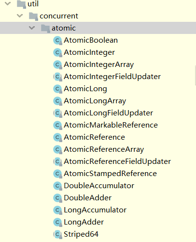

# 并发编程之原子类


Java从JDK 1.5开始提供了java.util.concurrent.atomic包（以下简称Atomic包），这个包中 的原子操作类提供了一种用法简单、性能高效、线程安全地更新一个变量的方式。

**:baby_chick: 内部都是采用CAS+volatile实现了无锁并发**

这节不讲原理，只讲如何使用。

---

## 整体结构

 [并发编程之原子类.md](并发编程之原子类.md) 

从整体上可以分为5组，分别进行说明

---

:arrow_lower_right:

**基本类型**

使用原子的方式更新基本类型

- AtomicInteger：整形原子类
- AtomicLong：长整型原子类
- AtomicBoolean ：布尔型原子类

**数组类型**

使用原子的方式更新数组里的某个元素

- AtomicIntegerArray：整形数组原子类
- AtomicLongArray：长整形数组原子类
- AtomicReferenceArray ：引用类型数组原子类

**引用类型**

- AtomicReference：引用类型原子类
- AtomicStampedRerence：原子更新引用类型里的字段原子类
- AtomicMarkableReference ：原子更新带有标记位的引用类型

**对象的属性修改类型**

- AtomicIntegerFieldUpdater:原子更新整形字段的更新器
- AtomicLongFieldUpdater：原子更新长整形字段的更新器
- AtomicStampedReference ：原子更新带有版本号的引用类型。该类将整数值与引用关联起来，可用于解决原子的更新数据和数据的版本号，可以解决使用 CAS 进行原子更新时可能出现的 ABA 问题。

下面我们来详细介绍一下这些原子类。

CAS操作成功的前提是对内存地址的比较，即未`==`而不是equals。

---

## :one: 原子整数

使用原子的方式更新基本类型

- AtomicInteger：整形原子类
- AtomicLong：长整型原子类
- AtomicBoolean ：布尔型原子类


上面三个类提供的方法几乎相同，也是最为java程序员所熟知的。

所以我们这里以 AtomicInteger 为例子来介绍。

```java
AtomicInteger i = new AtomicInteger(0);
// 获取并自增（i = 0, 结果 i = 1, 返回 0），类似于 i++
System.out.println(i.getAndIncrement());
// 自增并获取（i = 1, 结果 i = 2, 返回 2），类似于 ++i
System.out.println(i.incrementAndGet());
// 自减并获取（i = 2, 结果 i = 1, 返回 1），类似于 --i
System.out.println(i.decrementAndGet());
// 获取并自减（i = 1, 结果 i = 0, 返回 1），类似于 i--
System.out.println(i.getAndDecrement());
// 获取并加值（i = 0, 结果 i = 5, 返回 0）
System.out.println(i.getAndAdd(5));
// 加值并获取（i = 5, 结果 i = 0, 返回 0）
System.out.println(i.addAndGet(-5));
// 获取并更新（i = 0, p 为 i 的当前值, 结果 i = -2, 返回 0）
// 其中函数中的操作能保证原子，但函数需要无副作用
System.out.println(i.getAndUpdate(p -> p - 2));
// 更新并获取（i = -2, p 为 i 的当前值, 结果 i = 0, 返回 0）
// 其中函数中的操作能保证原子，但函数需要无副作用
System.out.println(i.updateAndGet(p -> p + 2));
// 获取并计算（i = 0, p 为 i 的当前值, x 为参数1, 结果 i = 10, 返回 0）
// 其中函数中的操作能保证原子，但函数需要无副作用
// getAndUpdate 如果在 lambda 中引用了外部的局部变量，要保证该局部变量是 final 的
// getAndAccumulate 可以通过 参数1 来引用外部的局部变量，但因为其不在 lambda 中因此不必是 final
System.out.println(i.getAndAccumulate(10, (p, x) -> p + x));
// 计算并获取（i = 10, p 为 i 的当前值, x 为参数1, 结果 i = 0, 返回 0）
// 其中函数中的操作能保证原子，但函数需要无副作用
System.out.println(i.accumulateAndGet(-10, (p, x) -> p + x));
```

## :two:原子引用

基本类型原子类只能更新一个变量，如果需要原子更新多个变量，需要使用 引用类型原子类。

- AtomicReference：引用类型原子类
- AtomicStampedRerence：原子更新引用类型里的字段原子类
- AtomicMarkableReference ：原子更新带有标记位的引用类型

上面三个类提供的方法几乎相同，所以我们这里以 AtomicReference 为例子来介绍。

定义一个接口

```java
interface DecimalAccount {
    // 获取余额
    BigDecimal getBalance();

    // 取款
    void withdraw(BigDecimal amount);

    /**
     * 方法内会启动 1000 个线程，每个线程做 -10 元 的操作
     * 如果初始余额为 10000 那么正确的结果应当是 0
     */
    static void demo(DecimalAccount account) {
        List<Thread> ts = new ArrayList<>();
        for (int i = 0; i < 1000; i++) {
            ts.add(new Thread(() -> {
                account.withdraw(BigDecimal.TEN);
            }));
        }
        ts.forEach(Thread::start);
        ts.forEach(t -> {
            try {
                t.join();
            } catch (InterruptedException e) {
                e.printStackTrace();
            }
        });
        System.out.println(account.getBalance());
    }
}
```

我们为之提供一个**安全的实现**

```java
public class Test35 {
    public static void main(String[] args) {
        DecimalAccount.demo(new DecimalAccountCas(new BigDecimal("10000")));
    }
}

class DecimalAccountCas implements DecimalAccount {
    private AtomicReference<BigDecimal> balance;

    public DecimalAccountCas(BigDecimal balance) {
//        this.balance = balance;
        this.balance = new AtomicReference<>(balance);
    }

    @Override
    public BigDecimal getBalance() {
        return balance.get();
    }

    @Override
    public void withdraw(BigDecimal amount) {
        while(true) {
            BigDecimal prev = balance.get();
            BigDecimal next = prev.subtract(amount);
            if (balance.compareAndSet(prev, next)) {
                break;
            }
        }
    }
}
```


这里使用了`AtomicReference<BigDecimal> balance;`

再举一例：

```java
import java.util.concurrent.atomic.AtomicReference;

public class AtomicReferenceTest {

	public static void main(String[] args) {
		AtomicReference<Person> ar = new AtomicReference<Person>();
		Person person = new Person("SnailClimb", 22);
		ar.set(person);
		Person updatePerson = new Person("Daisy", 20);
		ar.compareAndSet(person, updatePerson);

		System.out.println(ar.get().getName());
		System.out.println(ar.get().getAge());
	}
}

@Data
class Person {
	private String name;
	private int age;
}

```


:blue_heart:这里注意理解Reference一词，通俗的解释，即引用，

我们在进行CAS操作的时候，比较的是`==`

即只要引用地址未发生改变，比如上面示例中对`person`对象中的字段进行改变，但`ar`引用是未改变的。

所以依旧可以更新成功。

---

**:couple_with_heart:ABA问题**

示例：

```java
static AtomicReference<String> ref = new AtomicReference<>("A");
public static void main(String[] args) throws InterruptedException {
	log.debug("main start...");
	// 获取值 A
	// 这个共享变量被它线程修改过？
	String prev = ref.get();
	other();
	sleep(1);
	// 尝试改为 C
	log.debug("change A->C {}", ref.compareAndSet(prev, "C"));
}
	private static void other() {
		new Thread(() -> {
			log.debug("change A->B {}", ref.compareAndSet(ref.get(), "B"));
		}, "t1").start();
		sleep(0.5);
   		new Thread(() -> {
			log.debug("change B->A {}", ref.compareAndSet(ref.get(), "A"));
		}, "t2").start();
	}
```

输出：

```
11:29:52.325 c.Test36 [main] - main start...
11:29:52.379 c.Test36 [t1] - change A->B true
11:29:52.879 c.Test36 [t2] - change B->A true
11:29:53.880 c.Test36 [main] - change A->C true
```

主线程仅能判断出共享变量的值与最初值 A 是否相同，不能感知到这种从 A 改为 B 又 改回 A 的情况，如果主线程
希望：
只要有其它线程【动过了】共享变量，那么自己的 cas 就算失败，这时，仅比较值是不够的，需要再加一个版本号
**AtomicStampedReference**


```java
@Slf4j(topic = "c.Test36")
public class Test36 {

    static AtomicStampedReference<String> ref = new AtomicStampedReference<>("A", 0);

    public static void main(String[] args) throws InterruptedException {
        log.debug("main start...");
        // 获取值 A
        String prev = ref.getReference();
        // 获取版本号
        int stamp = ref.getStamp();
        log.debug("版本 {}", stamp);
        // 如果中间有其它线程干扰，发生了 ABA 现象
        other();
        sleep(1);
        // 尝试改为 C
        log.debug("change A->C {}", ref.compareAndSet(prev, "C", stamp, stamp + 1));
    }

    private static void other() {
        new Thread(() -> {
            log.debug("change A->B {}", ref.compareAndSet(ref.getReference(), "B", ref.getStamp(), ref.getStamp() + 1));
            log.debug("更新版本为 {}", ref.getStamp());
        }, "t1").start();
        sleep(0.5);
        new Thread(() -> {
            log.debug("change B->A {}", ref.compareAndSet(ref.getReference(), "A", ref.getStamp(), ref.getStamp() + 1));
            log.debug("更新版本为 {}", ref.getStamp());
        }, "t2").start();
    }
}
```

输出

```
15:41:34.891 c.Test36 [main] - main start...
15:41:34.894 c.Test36 [main] - 版本 0
15:41:34.956 c.Test36 [t1] - change A->B true
15:41:34.956 c.Test36 [t1] - 更新版本为 1
15:41:35.457 c.Test36 [t2] - change B->A true
15:41:35.457 c.Test36 [t2] - 更新版本为 2
15:41:36.457 c.Test36 [main] - change A->C false
```

**AtomicStampedReference** 可以给原子引用加上版本号，追踪原子引用整个的变化过程，如：  A -> B -> A ->
C ，通过AtomicStampedReference，我们可以知道，引用变量中途被更改了几次。
但是有时候，并不关心引用变量更改了几次，只是单纯的关心是否更改过，所以就有了
**AtomicMarkableReference**

---

## :three: 原子数组

使用原子的方式更新数组里的某个元素

- AtomicIntegerArray：整形数组原子类
- AtomicLongArray：长整形数组原子类
- AtomicReferenceArray ：引用类型数组原子类

上面三个类提供的方法几乎相同，所以我们这里以 AtomicIntegerArray 为例子来介绍。

**AtomicIntegerArray 类常用方法**

```java

public final int get(int i) //获取 index=i 位置元素的值
public final int getAndSet(int i, int newValue)//返回 index=i 位置的当前的值，并将其设置为新值：newValue
public final int getAndIncrement(int i)//获取 index=i 位置元素的值，并让该位置的元素自增
public final int getAndDecrement(int i) //获取 index=i 位置元素的值，并让该位置的元素自减
public final int getAndAdd(int delta) //获取 index=i 位置元素的值，并加上预期的值
boolean compareAndSet(int expect, int update) //如果输入的数值等于预期值，则以原子方式将 index=i 位置的元素值设置为输入值（update）
public final void lazySet(int i, int newValue)//最终 将index=i 位置的元素设置为newValue,使用 lazySet 设置之后可能导致其他线程在之后的一小段时间内还是可以读到旧的值。

```

---

## :four:字段更新器

如果需要原子更新某个类里的某个字段时，需要用到对象的属性修改类型原子类。

- AtomicIntegerFieldUpdater:原子更新整形字段的更新器
- AtomicLongFieldUpdater：原子更新长整形字段的更新器
- AtomicReferenceFieldUpdater：原子更新引用字段的更新器

要想原子地更新对象的属性需要两步。第一步，因为对象的属性修改类型原子类都是抽象类，所以每次使用都必须使用静态方法 newUpdater()创建一个更新器，并且需要设置想要更新的类和属性。第二步，更新的对象属性必须使用 public volatile 修饰符。

上面三个类提供的方法几乎相同，所以我们这里以 AtomicReferenceFieldUpdater为例子来介绍。

```java

public class Test40 {

    public static void main(String[] args) {
        Student stu = new Student();

        AtomicReferenceFieldUpdater updater =
                AtomicReferenceFieldUpdater.newUpdater(Student.class, String.class, "name");

        System.out.println(updater.compareAndSet(stu, null, "张三"));
        System.out.println(stu);
    }
}

class Student {
    volatile String name;

    @Override
    public String toString() {
        return "Student{" +
                "name='" + name + '\'' +
                '}';
    }
}
```

---

## :five:原子累加器

高性能原子类，是java8中增加的原子类，它们使用分段的思想，把不同的线程hash到不同的段上去更新，最后再把这些段的值相加得到最终的值，这些类主要有：

（1）Striped64

下面四个类的父类。

（2）LongAccumulator

long类型的聚合器，需要传入一个long类型的二元操作，可以用来计算各种聚合操作，包括加乘等。

（3）LongAdder

long类型的累加器，LongAccumulator的特例，只能用来计算加法，且从0开始计算。

（4）DoubleAccumulator

double类型的聚合器，需要传入一个double类型的二元操作，可以用来计算各种聚合操作，包括加乘等。

（5）DoubleAdder

double类型的累加器，DoubleAccumulator的特例，只能用来计算加法，且从0开始计算。

这几个类的操作基本类似，其中DoubleAccumulator和DoubleAdder底层其实也是用long来实现的，基本用法如下：

```java
private static void testNewAtomic() {
    LongAdder longAdder = new LongAdder();
    longAdder.increment();
    longAdder.add(666);
    System.out.println(longAdder.sum());

    LongAccumulator longAccumulator = new LongAccumulator((left, right)->left + right * 2, 666);
    longAccumulator.accumulate(1);
    longAccumulator.accumulate(3);
    longAccumulator.accumulate(-4);
    System.out.println(longAccumulator.get());
}

```

---


## :kissing:参考和感谢

[AtomicReference compareAndSwap是比较对象的地址吗](https://segmentfault.com/q/1010000008287803)

[JUC解析-LongAdder](https://juejin.im/post/5ad837a2f265da505c3c1ca2)

