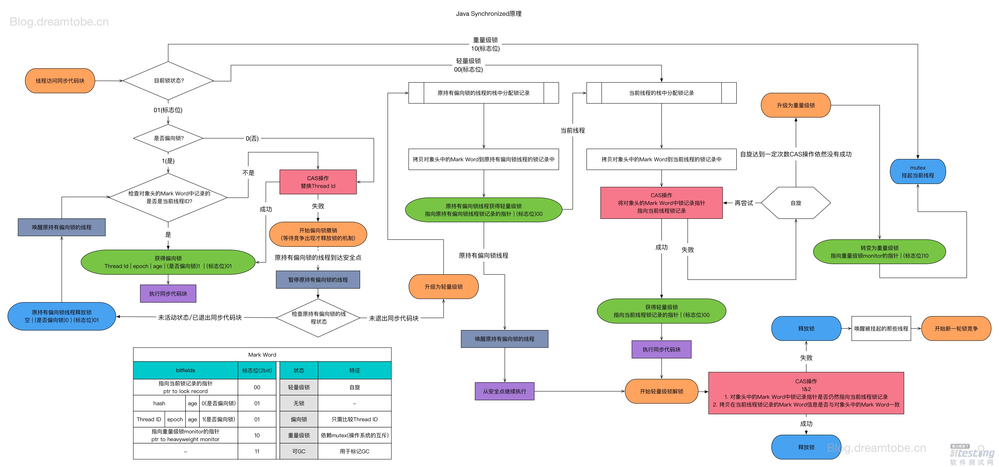

# 面试题收集

## 一、JVM相关

### 1.java中的对象都是在堆上分配的吗？

为了防止歧义，可以换个说法：Java对象实例和数组元素都是在堆上分配内存的吗？

答：不一定。满足特定条件时，它们可以在（虚拟机）栈上分配内存。

**关键字：逃逸分析、标量替换**

### 2.​​jvm内存结构:star:

如下图：


对于**运行时数据区**，再详细一点如下图：


如果按照线程是否共享来分类的话，如下图所示：


**堆空间:**


**创建一个新对象 内存分配流程**


**虚拟机栈：**


https://segmentfault.com/a/1190000021424972

### 3.对象的组成

对象在内存中存储的布局可以分为3块区域：==对象头（Header）、实例数据（Instance Data）和对齐填充（Padding）==。

下图是普通对象实例与数组对象实例的数据结构：


1. **对象头**

HotSpot虚拟机的对象头包括两部分信息：

* ==Mark Word==:flags:

第一部分markword,用于存储对象自身的运行时数据，如哈希码（HashCode）、GC分代年龄、锁状态标志、线程持有的锁、偏向线程ID、偏向时间戳等，这部分数据的长度在32位和64位的虚拟机（未开启压缩指针）中分别为32bit和64bit，官方称它为“MarkWord”。

* Klass Pointer

对象头的另外一部分是klass类型指针，即对象指向它的类元数据的指针，虚拟机通过这个指针来确定这个对象是哪个类的实例.

2. **实例数据**

 实例数据部分是对象真正存储的有效信息，也是在程序代码中所定义的各种类型的字段内容。无论是从父类继承下来的，还是在子类中定义的，都需要记录起来。

这里举个例子：

```java
public class Math {
    public static void main(String[] args) {
        Math math = new Math();
        Math math2 = new Math();
        System.out.println("test");
    }
}
```

画图表示：


**其中的klass类型指针就是那条红色的联系，**

类加载其实最终是以类元信息的形式存储在方法区中的，math和math2都是由同一个类new出来的，当对象被new时，都会在对象头中存储一个指向类元信息的指针，这就是Klass Pointer.

3. **数组长度（只有数组对象有）**

如果对象是一个数组, 那在对象头中还必须有一块数据用于记录数组长度.

1. **对齐填充**

第三部分对齐填充并不是必然存在的，也没有特别的含义，它仅仅起着占位符的作用。由于HotSpot VM的自动内存管理系统要求对象起始地址必须是8字节的整数倍，换句话说，就是对象的大小必须是8字节的整数倍。而对象头部分正好是8字节的倍数（1倍或者2倍），因此，当对象实例数据部分没有对齐时，就需要通过对齐填充来补全。

### 4.哪些对象可以作为 GC Root 呢


如图示，如果用可达性算法即可解决上述循环引用的问题，因为从**GC Root** 出发没有到达 a,b,所以 a，b 可回收

a, b 对象可回收，就一定会被回收吗?并不是，对象的 finalize 方法给了对象一次垂死挣扎的机会，当对象不可达（可回收）时，当发生GC时，会先判断对象是否执行了 finalize 方法，如果未执行，则会先执行 finalize 方法，我们可以在此方法里将当前对象与 GC Roots 关联，这样执行 finalize 方法之后，GC 会再次判断对象是否可达，如果不可达，则会被回收，如果可达，则不回收！

**注意：** finalize 方法只会被执行一次，如果第一次执行 finalize 方法此对象变成了可达确实不会回收，但如果对象再次被 GC，则会忽略 finalize 方法，对象会被回收！这一点切记!

那么这些 **GC Roots** 到底是什么东西呢，哪些对象可以作为 GC Root 呢，有以下几类

- 虚拟机栈（栈帧中的本地变量表）中引用的对象
- 方法区中类静态属性引用的对象
- 方法区中常量引用的对象
- 本地方法栈中 JNI（即一般说的 Native 方法）引用的对象

### 5.空间分配担保(何时会发生Full GC?):bullettrain_front:

在发生 MinorGC 之前，虚拟机会先检查老年代最大可用的连续空间是否大于新生代所有对象的总空间，如果大于，那么Minor GC 可以确保是安全的,如果不大于，那么虚拟机会查看 HandlePromotionFailure 设置值是否允许担保失败。如果允许，那么会继续检查老年代最大可用连续空间是否大于历次晋升到老年代对象的平均大小，如果大于则进行 Minor GC，否则可能进行一次 Full GC。

### 6.何为STW？

**Stop The World**

如果老年代满了，会触发 Full GC, Full GC 会同时回收新生代和老年代（即对整个堆进行GC），它会导致 Stop The World（简称 STW）,造成挺大的性能开销。

什么是 STW ？所谓的 STW, 即在 GC（minor GC 或 Full GC）期间，只有垃圾回收器线程在工作，其他工作线程则被挂起。

画外音：为啥在垃圾收集期间其他工作线程会被挂起？想象一下，你一边在收垃圾，另外一群人一边丢垃圾，垃圾能收拾干净吗。

一般 Full GC 会导致工作线程停顿时间过长（因为Full GC 会清理**整个堆**中的不可用对象，一般要花较长的时间），如果在此 server 收到了很多请求，则会被拒绝服务！所以我们要尽量减少 Full GC（Minor GC 也会造成 STW,但只会触发轻微的 STW,因为 Eden 区的对象大部分都被回收了，只有极少数存活对象会通过复制算法转移到 S0 或 S1 区，所以相对还好）。

现在我们应该明白把新生代设置成 Eden, S0，S1区或者给对象设置年龄阈值或者默认把新生代与老年代的空间大小设置成 1:2 都是为了**尽可能地避免对象过早地进入老年代，尽可能晚地触发 Full GC**。想想新生代如果只设置 Eden 会发生什么，后果就是每经过一次 Minor GC，存活对象会过早地进入老年代，那么老年代很快就会装满，很快会触发 Full GC，而对象其实在经过两三次的 Minor GC 后大部分都会消亡，所以有了 S0,S1的缓冲，只有少数的对象会进入老年代，老年代大小也就不会这么快地增长，也就避免了过早地触发 Full GC。

由于 Full GC（或Minor GC） 会影响性能，所以我们要在一个合适的时间点发起 GC，这个时间点被称为 Safe Point，这个时间点的选定既不能太少以让 GC 时间太长导致程序过长时间卡顿，也不能过于频繁以至于过分增大运行时的负荷。一般当线程在这个时间点上状态是可以确定的，如确定 GC Root 的信息等，可以使 JVM 开始安全地 GC。Safe Point 主要指的是以下特定位置：

- 循环的末尾
- 方法返回前
- 调用方法的 call 之后
- 抛出异常的位置 另外需要注意的是由于新生代的特点（大部分对象经过 Minor GC后会消亡）， Minor GC 用的是复制算法，而在老生代由于对象比较多，占用的空间较大，使用复制算法会有较大开销（复制算法在对象存活率较高时要进行多次复制操作，同时浪费一半空间）所以根据老生代特点，在老年代进行的 GC 一般采用的是标记整理法来进行回收

### 7.垃圾收集器


图片中的垃圾收集器如果存在连线，则代表它们之间可以配合使用，接下来我们来看看各个垃圾收集器的具体功能。


链接：https://juejin.im/post/5e378c13e51d454d5177b8df

------

### 8.类的主动使用和被动使用

**主动使用：**

* 创建类的实例
* 访问某个类或接口的静态变量，或者对该静态变量赋值
* 调用类的静态方法
* 反射（比如：Class.forName("com.helius.Test")
* 初始化一个类的子类
* Java虚拟机启动时被标明为启动类的类
* JDK7开始提供的动态语言支持：java.lang.invoke.MethodHandle实例的解析结果REF_getStatic、REF_putStatic、REF_invokeStatic句柄对应的类没有初始化，则初始化

其他都是**对类的被动使用**，都不会导致对 **类的初始化**

## 二、集合框架

### **1. java中的队列：**


**线程池中用的很多。**


## 三、JUC

### 1.线程池

#### 1.1 线程池相关概念、执行流程、参数意义等等

略

#### 1.2 当提交新任务时，异常如何处理？

针对submit方法而言、execute方法会主动抛出异常


### 2.AQS（AbstractQueuedSynchronizer）

先通过下面的架构图来整体了解一下 `AQS` 框架：


### 3.synchronized锁



## 四、分布式家族

### 一、消息中间件

#### 1. RocketMQ架构图


明天再看：

https://mp.weixin.qq.com/s/mq7t2ocIBxt96haE82HpFQ

----

<font size='6' color='red'>好文收藏：</font>

**后面列的是没掌握的部分**

[图文详解垃圾回收](https://juejin.im/post/5e378c13e51d454d5177b8df)：垃圾回收器部分

[MySQL相关（三）- 索引数据模型推演及 B+Tree 的详细介绍](https://juejin.im/post/5e3a8c86f265da571e260a4e#heading-10)，详细介绍了Mysql索引的数据结构，值得记

[Synchronized解析——如果你愿意一层一层剥开我的心](https://juejin.im/post/5d5374076fb9a06ac76da894)