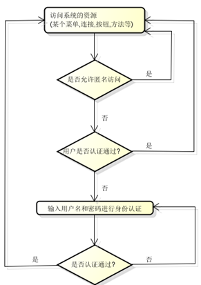
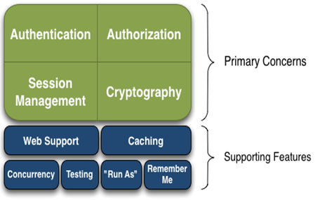
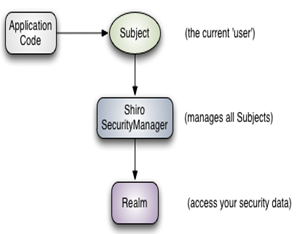

# Shiro入门（一）

## 一、Shiro简介

基本上涉及到用户参与的系统都要进行权限管理，权限管理属于系统安全的范畴，权限管理能实现对用户访问系统的控制，按照安全规则或者安全策略限制用户操作，只允许用户访问被授权的资源。

权限管理包括用户身份**认证和授权**两部分，简称**认证授权。**

* 身份认证

​      就是判断一个用户是否为合法用户的处理过程.醉常用的简单身份认证方式是系统通过核对用户输入的用户名和口令,看其是否与系统中存储的该用户的用户名和口令一致,来判断用户身份是否正确.对于采用指纹等系统,则出示指纹；对于硬件Key等刷卡系统,则需要刷卡.

上边的流程图中需 要理解以下关键对象：

1. Subject：主体 user

访问系统的用户，主体可以是用户、程序等，进行认证的都称为主体；

2. Principal：身份信息(username)

是主体（subject）进行身份认证的标识，标识必须具有唯一性，如用户名、手机号、邮箱地址等，一个主体可以有多个身份，但是必须有一个主身份（Primary Principal）。

3. credential：凭证信息(password)

是只有主体自己知道的安全信息，如密码、证书等。

* 授权，即访问控制

控制谁能访问哪些资源。主体进行身份认证后需要分配权限方可访问系统的资源，对于某些资源没有权限是无法访问的。

----

Apache Shiro是Java的一个安全框架。帮助我们完成：**认证**、**授权**、**加密**、**会话管理**、**与Web集成、缓存**等。

* 从功能角度看：

  

**Authentication**：[ɔ:ˌθentɪ'keɪʃn]身份认证/登录，验证用户是不是拥有相应的身份；

**Authorization**：[ˌɔ:θərəˈzeɪʃn] 授权，即权限验证，验证某个已认证的用户是否拥有某个权限；即判断用户是否能做事情，常见的如：验证某个用户是否拥有某个角色。或者细粒度的验证某个用户对某个资源是否具有某个权限；

Session Manager：会话管理，即用户登录后就是一次会话，在没有退出之前，它的所有信息都在会话中；会话可以是普通JavaSE环境的，也可以是Web环境的；

**Cryptography**：[krɪpˈɑ:grəfi]加密，保护数据的安全性，如密码加密存储到数据库，而不是明文存储；

Web Support：Web支持，可以非常容易的集成到Web环境；

Caching：缓存，比如用户登录后，其用户信息、拥有的角色/权限不必每次去查，这样可以提高效率；

Concurrency：shiro支持多线程应用的并发验证，即如在一个线程中开启另一个线程，能把权限自动传播过去；

Testing：提供测试支持；

Run As：允许一个用户假装为另一个用户（如果他们允许）的身份进行访问；

Remember Me：记住我，这个是非常常见的功能，即一次登录后，下次再来的话不用登录了。

**Shiro架构有三个主要概念 - Subject，SecurityManager，Realms。**

* Subject ：  访问系统的用户，主体可以是用户、程序等，进行认证的都称为主体；

​     Subject一词是一个安全术语，其基本意思是“当前的操作用户”。它是一个抽象的概念，可以是人，也可以是第三方进程或其他类似事物，如爬虫，机器人等。

  在程序任意位置：Subject currentUser = SecurityUtils.getSubject(); 获取shiro

  一旦获得Subject，你就可以立即获得你希望用Shiro为当前用户做的90%的事情，如登录、登出、访问会话、执行授权检查等

* SecurityManager

​    安全管理器，它是shiro功能实现的核心，负责与后边介绍的其他组件(认证器/授权器/缓存控制器)进行交互，实现subject委托的各种功能。有点类似于spirngmvc中的DispatcherServlet前端控制器。

* Realms

   Realm充当了Shiro与应用安全数据间的“桥梁”或者“连接器”。；可以把Realm看成DataSource，即安全数据源。执行认证（登录）和授权（访问控制）时，Shiro会从应用配置的Realm中查找相关的比对数据。以确认用户是否合法，操作是否合理

* **从系统结构角度看：shiro**

Subject：主体，可以看到主体可以是任何可以与应用交互的“用户”；

SecurityManager：相当于SpringMVC中的DispatcherServlet或者Struts2中的FilterDispatcher；是Shiro的心脏；所有具体的交互都通过SecurityManager进行控制；它管理着所有Subject、且负责进行认证和授权、及会话、缓存的管理。

Authenticator：认证器，负责主体认证的，这是一个扩展点，如果用户觉得Shiro默认的不好，可以自定义实现；其需要认证策略（Authentication Strategy），即什么情况下算用户认证通过了；

Authorizer：授权器，或者访问控制器，用来决定主体是否有权限进行相应的操作；即控制着用户能访问应用中的哪些功能；

Realm：可以有1个或多个Realm，可以认为是安全实体数据源，即用于获取安全实体的；可以是JDBC实现，也可以是LDAP实现，或者内存实现等等；由用户提供；注意：Shiro不知道你的用户/权限存储在哪及以何种格式存储；所以我们一般在应用中都需要实现自己的Realm；

SessionManager：如果写过Servlet就应该知道Session的概念，Session呢需要有人去管理它的生命周期，这个组件就是SessionManager；而Shiro并不仅仅可以用在Web环境，也可以用在如普通的JavaSE环境、EJB等环境；所有呢，Shiro就抽象了一个自己的Session来管理主体与应用之间交互的数据；可以实现分布式的会话管理；

SessionDAO：DAO大家都用过，数据访问对象，用于会话的CRUD，比如我们想把Session保存到数据库，那么可以实现自己的SessionDAO，通过如JDBC写到数据库；比如想把Session放到redis中，可以实现自己的redis SessionDAO；另外SessionDAO中可以使用Cache进行缓存，以提高性能；

CacheManager：缓存控制器，来管理如用户、角色、权限等的缓存的；因为这些数据基本上很少去改变，放到缓存中后可以提高访问的性能

Cryptography：密码模块，Shiro提高了一些常见的加密组件用于如密码加密/解密的。

---

**小结：Shiro的概念众多且难以理解，需要在实践中反复理解**

