# Zookeeper实现分布式锁

## 什么是分布式协调技术

分布式协调技术主要用来解决分布式环境当中多个进程之间的同步控制，让他们有序的去访问某种临界资源，防止造成"脏数据"的后果。

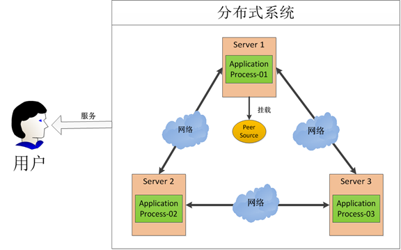

在这图中有三台机器，每台机器各跑一个应用程序。然后我们将这三台机器通过网络将其连接起来，构成一个系统来为用户提供服务，对用户来说这个系统的架构是透明的，他感觉不到我这个系统是一个什么样的架构。那么我们就可以把这种系统称作一个**分布式系统**。

在这个分布式系统中如何对进程进行调度，我假设在第一台机器上挂载了一个资源，然后这三个物理分布的进程都要竞争这个资源，但我们又不希望他们同时进行访问，这时候我们就需要一个**协调器**，来让他们有序的来访问这个资源。这个协调器就是我们经常提到的那个**锁**，比如说"进程-1"在使用该资源的时候，会先去获得锁，"进程1"获得锁以后会对该资源保持**独占**，这样其他进程就无法访问该资源，"进程1"用完该资源以后就将锁释放掉，让其他进程来获得锁，那么通过这个锁机制，我们就能保证了分布式系统中多个进程能够有序的访问该临界资源。那么我们把这个分布式环境下的这个锁叫作**分布式锁**。这个分布式锁也就是我们**分布式协调技术**实现的核心内容。

## 什么是分布式锁

### 概述

为了防止分布式系统中的多个进程之间相互干扰，我们需要一种分布式协调技术来对这些进程进行调度。而这个分布式协调技术的核心就是来实现这个**分布式锁**。

### 为什么要使用分布式锁

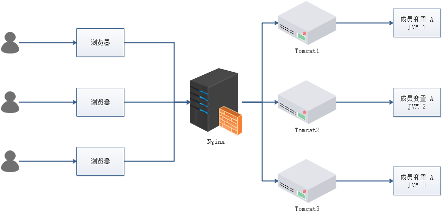

- 成员变量 A 存在 JVM1、JVM2、JVM3 三个 JVM 内存中
- 成员变量 A 同时都会在 JVM 分配一块内存，三个请求发过来同时对这个变量操作，显然结果是不对的
- 不是同时发过来，三个请求分别操作三个不同 JVM 内存区域的数据，变量 A 之间不存在共享，也不具有可见性，处理的结果也是不对的 注：该成员变量 A 是一个有状态的对象

如果我们业务中确实存在这个场景的话，我们就需要一种方法解决这个问题，**这就是分布式锁要解决的问题**

### 分布式锁应该具备哪些条件

- 在分布式系统环境下，一个方法在同一时间只能被一个机器的一个线程执行
- 高可用的获取锁与释放锁
- 高性能的获取锁与释放锁
- 具备可重入特性（可理解为重新进入，由多于一个任务并发使用，而不必担心数据错误）
- 具备锁失效机制，防止死锁
- 具备非阻塞锁特性，即没有获取到锁将直接返回获取锁失败

### 分布式锁的实现有哪些

- Memcached：利用 Memcached 的 `add` 命令。此命令是原子性操作，只有在 `key` 不存在的情况下，才能 `add` 成功，也就意味着线程得到了锁。
- Redis：和 Memcached 的方式类似，利用 Redis 的 `setnx` 命令。此命令同样是原子性操作，只有在 `key` 不存在的情况下，才能 `set` 成功。
- **Zookeeper**：利用 Zookeeper 的顺序临时节点，来实现分布式锁和等待队列。Zookeeper 设计的初衷，就是为了实现分布式锁服务的。
- Chubby：Google 公司实现的粗粒度分布式锁服务，底层利用了 Paxos 一致性算法。

### 通过 Redis 分布式锁的实现理解基本概念

分布式锁实现的三个核心要素：

#### 加锁

最简单的方法是使用 `setnx` 命令。`key` 是锁的唯一标识，按业务来决定命名。比如想要给一种商品的秒杀活动加锁，可以给 `key` 命名为 “lock_sale_商品ID” 。而 `value` 设置成什么呢？我们可以姑且设置成 `1`。加锁的伪代码如下：

```text
setnx（lock_sale_商品ID，1）
```

当一个线程执行 `setnx` 返回 `1`，说明 `key` 原本不存在，该线程成功得到了锁；当一个线程执行 `setnx` 返回 `0`，说明 `key` 已经存在，该线程抢锁失败。

#### 解锁

有加锁就得有解锁。当得到锁的线程执行完任务，需要释放锁，以便其他线程可以进入。释放锁的最简单方式是执行 `del` 指令，伪代码如下：

```text
del（lock_sale_商品ID）
```

释放锁之后，其他线程就可以继续执行 `setnx` 命令来获得锁。

#### 锁超时

锁超时是什么意思呢？如果一个得到锁的线程在执行任务的过程中挂掉，来不及显式地释放锁，这块资源将会永远被锁住（**死锁**），别的线程再也别想进来。所以，`setnx` 的 `key` 必须设置一个超时时间，以保证即使没有被显式释放，这把锁也要在一定时间后自动释放。`setnx` 不支持超时参数，所以需要额外的指令，伪代码如下：

```java
expire（lock_sale_商品ID， 30）
```

综合伪代码如下：

```java
if（setnx（lock_sale_商品ID，1） == 1）{
    expire（lock_sale_商品ID，30）
    try {
        do something ......
    } finally {
        del（lock_sale_商品ID）
    }
}
```

### 存在什么问题

以上伪代码中存在三个致命问题

#### `setnx` 和 `expire` 的非原子性

设想一个极端场景，当某线程执行 `setnx`，成功得到了锁：


`setnx` 刚执行成功，还未来得及执行 `expire` 指令，节点 1 挂掉了。


这样一来，这把锁就没有设置过期时间，变成**死锁**，别的线程再也无法获得锁了。

怎么解决呢？`setnx` 指令本身是不支持传入超时时间的，`set` 指令增加了可选参数，伪代码如下：

```text
set（lock_sale_商品ID，1，30，NX）
```

这样就可以取代 `setnx` 指令。

#### `del` 导致误删

又是一个极端场景，假如某线程成功得到了锁，并且设置的超时时间是 30 秒。


如果某些原因导致线程 A 执行的很慢很慢，过了 30 秒都没执行完，这时候锁过期自动释放，线程 B 得到了锁。


随后，线程 A 执行完了任务，线程 A 接着执行 `del` 指令来释放锁。但这时候线程 B 还没执行完，线程A实际上 `删除的是线程 B 加的锁`。


怎么避免这种情况呢？可以在 `del` 释放锁之前做一个判断，验证当前的锁是不是自己加的锁。至于具体的实现，可以在加锁的时候把当前的线程 ID 当做 `value`，并在删除之前验证 `key` 对应的 `value` 是不是自己线程的 ID。

加锁：

```java
String threadId = Thread.currentThread().getId()
set（key，threadId ，30，NX）
```

解锁：

```java
if（threadId .equals(redisClient.get(key))）{
    del(key)
}
```

但是，这样做又隐含了一个新的问题，判断和释放锁是两个独立操作，不是原子性。

#### 出现并发的可能性

还是刚才第二点所描述的场景，虽然我们避免了线程 A 误删掉 `key` 的情况，但是同一时间有 A，B 两个线程在访问代码块，仍然是不完美的。怎么办呢？我们可以让获得锁的线程开启一个**守护线程**，用来给快要过期的锁“续航”。


当过去了 29 秒，线程 A 还没执行完，这时候守护线程会执行 `expire` 指令，为这把锁“续命”20 秒。守护线程从第 29 秒开始执行，每 20 秒执行一次。

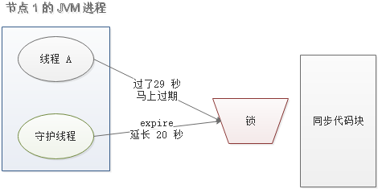

当线程 A 执行完任务，会显式关掉守护线程。


另一种情况，如果节点 1 忽然断电，由于线程 A 和守护线程在同一个进程，守护线程也会停下。这把锁到了超时的时候，没人给它续命，也就自动释放了。


---

### zookeeper如何实现分布式锁

#### 什么是临时顺序节点？

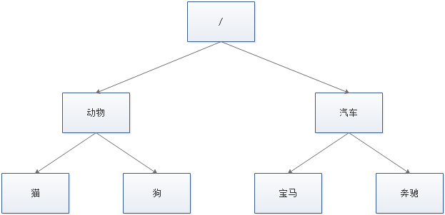

Zookeeper 的数据存储结构就像一棵树，这棵树由节点组成，这种节点叫做 Znode。

Znode 分为四种类型：

#### 持久节点（PERSISTENT）

默认的节点类型。创建节点的客户端与 Zookeeper 断开连接后，该节点依旧存在。

#### 持久节点顺序节点（PERSISTENT_SEQUENTIAL）

所谓顺序节点，就是在创建节点时，Zookeeper 根据创建的时间顺序给该节点名称进行编号：

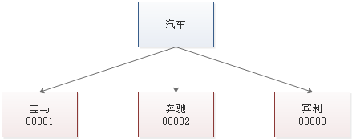

#### 临时节点（EPHEMERAL）

和持久节点相反，当创建节点的客户端与 Zookeeper 断开连接后，临时节点会被删除：

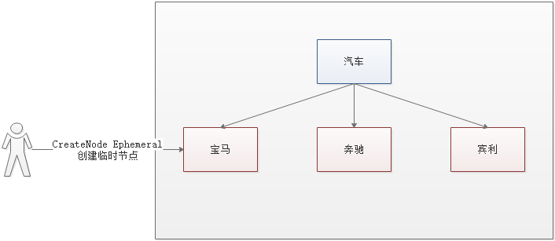

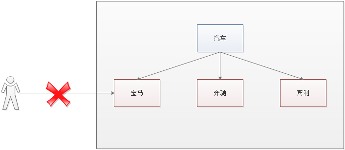

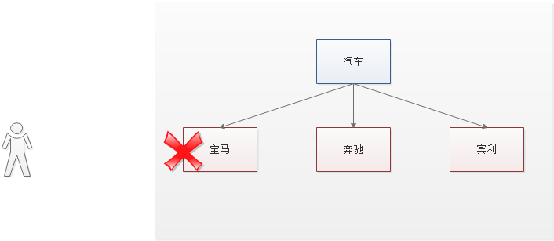

#### 临时顺序节点（EPHEMERAL_SEQUENTIAL）

顾名思义，临时顺序节点结合和临时节点和顺序节点的特点：在创建节点时，Zookeeper 根据创建的时间顺序给该节点名称进行编号；当创建节点的客户端与 Zookeeper 断开连接后，临时节点会被删除。

### Zookeeper 分布式锁的原理

Zookeeper 分布式锁恰恰应用了临时顺序节点。具体如何实现呢？让我们来看一看详细步骤：

#### 获取锁

首先，在 Zookeeper 当中创建一个持久节点 ParentLock。当第一个客户端想要获得锁时，需要在 ParentLock 这个节点下面创建一个**临时顺序节点** Lock1。


之后，Client1 查找 ParentLock 下面所有的临时顺序节点并排序，判断自己所创建的节点 Lock1 是不是顺序最靠前的一个。如果是第一个节点，则成功获得锁。


这时候，如果再有一个客户端 Client2 前来获取锁，则在 ParentLock 下载再创建一个临时顺序节点 Lock2。


Client2 查找 ParentLock 下面所有的临时顺序节点并排序，判断自己所创建的节点 Lock2 是不是顺序最靠前的一个，结果发现节点 Lock2 并不是最小的。

于是，Client2 向排序仅比它靠前的节点 Lock1 注册 Watcher，用于监听 Lock1 节点是否存在。这意味着 Client2 抢锁失败，进入了等待状态。

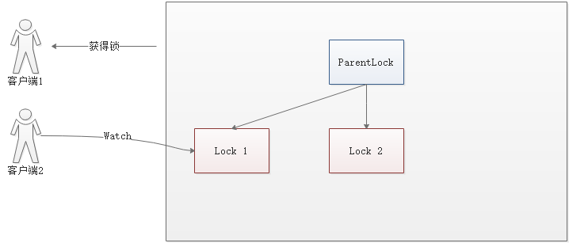

这时候，如果又有一个客户端 Client3 前来获取锁，则在 ParentLock 下载再创建一个临时顺序节点 Lock3。

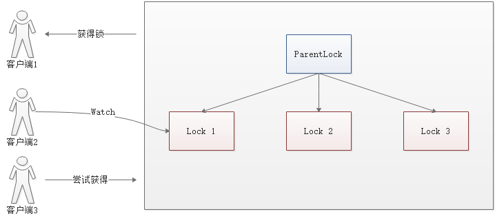

Client3 查找 ParentLock 下面所有的临时顺序节点并排序，判断自己所创建的节点 Lock3 是不是顺序最靠前的一个，结果同样发现节点 Lock3 并不是最小的。

于是，Client3 向排序仅比它靠前的节点 Lock2 注册 Watcher，用于监听 Lock2 节点是否存在。这意味着 Client3 同样抢锁失败，进入了等待状态。

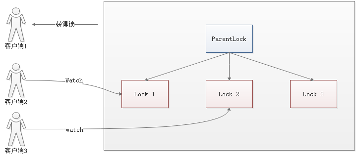

这样一来，Client1 得到了锁，Client2 监听了 Lock1，Client3 监听了 Lock2。这恰恰形成了一个等待队列，

#### 释放锁

释放锁分为两种情况：

##### 任务完成，客户端显示释放

当任务完成时，Client1 会显示调用删除节点 Lock1 的指令。


##### 任务执行过程中，客户端崩溃

获得锁的 Client1 在任务执行过程中，如果崩溃，则会断开与 Zookeeper 服务端的链接。根据临时节点的特性，相关联的节点 Lock1 会随之自动删除。

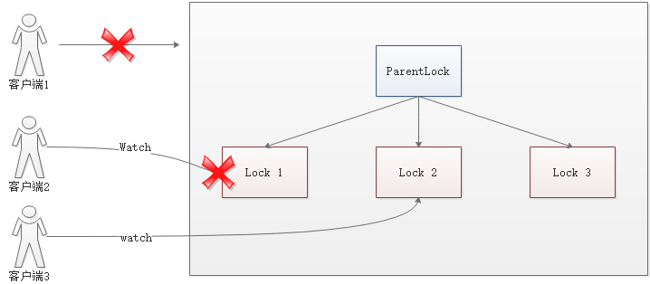

由于 Client2 一直监听着 Lock1 的存在状态，当 Lock1 节点被删除，Client2 会立刻收到通知。这时候 Client2 会再次查询 ParentLock 下面的所有节点，确认自己创建的节点 Lock2 是不是目前最小的节点。如果是最小，则 Client2 顺理成章获得了锁。

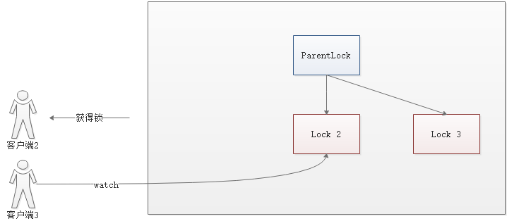

同理，如果 Client2 也因为任务完成或者节点崩溃而删除了节点 Lock2，那么 Client3 就会接到通知。


最终，Client3 成功得到了锁。

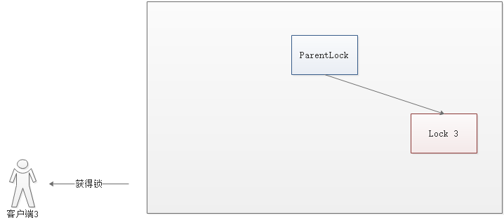

## Zookeeper 和 Redis 分布式锁的比较


原文链接：https://www.jianshu.com/p/976f3928c02d