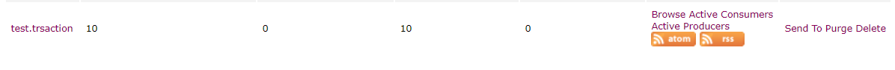

# activemq的事务消息

消息中间件大多支持事务消息，activemq也不例外。

关于事务的定义及ACID特性这里不赘述。

---

对比Mysql数据库来说，

Mysql有事务的概念，

Activemq也有事务的概念

这里说的都是本地事务，rocketMq还支持分布式事务

---

java制定了jdbc来规范对数据库的访问

同样

java也有jms（java message services）来规范对于消息中间件的访问，activemq是完全支持jms1.1规范的

---

那java通过mysql来实现事务，

无外乎大概这样：

```java
 public static void main(String[] args) {
        Connection conn =getConnection();
        try {
            conn.setAutoCommit(false);
            insertUser(conn);
            insertAddress(conn);
            conn.commit();
        } catch (SQLException e) {
            System.out.println("************事务处理出现异常***********");
            e.printStackTrace();
            try {
                conn.rollback();
                System.out.println("*********事务回滚成功***********");
            } catch (Exception e2) {
                // TODO: handle exception
                e2.printStackTrace();
            }finally {
                try {
                    conn.close();
                } catch (SQLException e1) {
                    // TODO Auto-generated catch block
                    e1.printStackTrace();
                }
            }
        }
    }
```


那我们接上文：[Spring整合Activemq](https://www.cnblogs.com/heliusKing/p/12243548.html)

来看看activemq如何实现**事务消息**

----

```java
    @Test
    public void p2pSender() {
        //获取连接工厂
        ConnectionFactory connectionFactory = jmsQueueTemplate.getConnectionFactory();
        Session session = null;
        try {
            Connection connection = connectionFactory.createConnection();
            // 参数一：是否开启消息事务
            session = connection.createSession(true, Session.AUTO_ACKNOWLEDGE);

            MessageProducer producer = session.createProducer(session.createQueue("test.trsaction"));
            //发送10条消息，开启事务后，要么一起成功，要么一起失败
            for (int i = 0; i < 10; i++) {
                if (i == 4) {
                    //出现异常
//                    throw new RuntimeException("i cannot equals 4");
                }
                TextMessage textMessage = session.createTextMessage("消息-----" + i);
                producer.send(textMessage);
            }
            //开启事务后，需要手动提交
            session.commit();
        } catch (JMSException e) {
            e.printStackTrace();
            //消息事务回滚
            try {
                session.rollback();
            } catch (JMSException ex) {
                ex.printStackTrace();
            }
        }
    }
```


上图我们手动制造了一个异常。

没有异常时：可以成功发送10条消息


我们把异常那行代码打开

，再次执行：

从控制台可以发现，信息并没有发出去。



即现在有事务效果。

---

另外需要一提的是:

整合入spring后，应该委托spring进行事务管理。

对于Mysql，我们配置了`DatasourceTransactionManager`，

使用@transactional注解即可。

对于activemq也是一样，不过使用的 就是JmsTransactionManager了。

---

还需要注意的是，分布式事务这块，mysql和activemq同为资源管理器（RM）,都实现了XA协议,activemq这个用的不多， 支持的也不完全，不赘述。