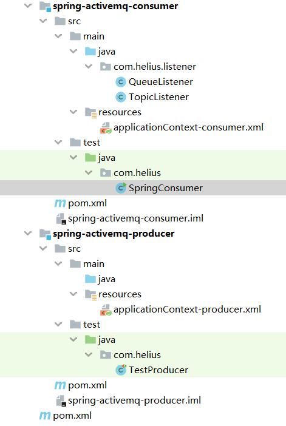

# Spring整合Activemq

## 一、项目结构

项目结构如何



两个模块，一个为消费方，一个为提供方，也可将两个模块合一，配置文件合一。

## 二、整合步骤

### 一、pom.xml

```xml
    <dependencies>
        <dependency>
            <groupId>org.apache.activemq</groupId>
            <artifactId>activemq-all</artifactId>
            <version>5.11.2</version>
        </dependency>
        <dependency>
            <groupId>org.springframework</groupId>
            <artifactId>spring-jms</artifactId>
            <version>5.1.6.RELEASE</version>
        </dependency>
        <dependency>
            <groupId>org.springframework</groupId>
            <artifactId>spring-context</artifactId>
            <version>5.1.6.RELEASE</version>
        </dependency>
        <dependency>
            <groupId>org.springframework</groupId>
            <artifactId>spring-context-support</artifactId>
            <version>5.1.6.RELEASE</version>
        </dependency>
        <dependency>
            <groupId>org.springframework</groupId>
            <artifactId>spring-test</artifactId>
            <version>5.1.6.RELEASE</version>
        </dependency>
        <dependency>
            <groupId>javax.jms</groupId>
            <artifactId>javax.jms-api</artifactId>
            <version>2.0.1</version>
        </dependency>
        <!-- https://mvnrepository.com/artifact/junit/junit -->
        <dependency>
            <groupId>junit</groupId>
            <artifactId>junit</artifactId>
            <version>4.12</version>
            <scope>test</scope>
        </dependency>
    </dependencies>
```

生产方、消费方一致

### 二、Producer模块

```xml
<?xml version="1.0" encoding="UTF-8"?>
<beans xmlns="http://www.springframework.org/schema/beans"
       xmlns:p="http://www.springframework.org/schema/p"
       xmlns:xsi="http://www.w3.org/2001/XMLSchema-instance" xmlns:amp="http://activemq.apache.org/schema/core"
       xsi:schemaLocation="http://www.springframework.org/schema/beans http://www.springframework.org/schema/beans/spring-beans.xsd http://activemq.apache.org/schema/core http://activemq.apache.org/schema/core/activemq-core.xsd">

<!--    1.创建连接工厂对象-->
<!--    <amp:connectionFactory
        id="connectionFactory"
        brokerURL="tcp://47.100.246.223:61616"
        userName="admin"
        password="admin"/>-->
    <bean id="connectionFactory" class="org.apache.activemq.ActiveMQConnectionFactory"
          p:brokerURL="tcp://47.100.246.223:61616" p:userName="admin" p:password="admin"></bean>
    <!--2. Spring Caching 连接工厂(类似数据库线程池的东西，减少连接的创建。) -->
    <!-- 由于jmsTemplate每次发送消息都需要创建连接和创建session了，所以引入这个类似连接池的连接工厂，优化Mq的性能 -->
    <bean id="cachingConnectionFactory" class="org.springframework.jms.connection.CachingConnectionFactory">
        <!-- 目标连接工厂 指向 ActiveMq工厂 -->
        <property name="targetConnectionFactory" ref="connectionFactory" />
        <!-- session缓存的最大个数-->
        <property name="sessionCacheSize" value="10" />
    </bean>
    <!--    3.创建用于点对点发送的JmsTemplate-->
    <bean id="jmsQueueTemplate" class="org.springframework.jms.core.JmsTemplate">
        <property name="connectionFactory" ref="cachingConnectionFactory" />
        <!-- 设置 jmsTemplate 不支持订阅模式，即：只支持queue模式。
         如果项目需要同时支持queue和topic，那么就需要另外注册一个jmsTemplate（把pubSubDomain设为true）-->
        <property name="pubSubDomain" value="false"></property>
    </bean>
<!--    4.创建用于发布订阅发送的JmsTemplate-->
    <bean id="jmsTopicTemplate" class="org.springframework.jms.core.JmsTemplate">
        <property name="connectionFactory" ref="cachingConnectionFactory" />
        <!-- 设置 jmsTemplate 不支持订阅模式，即：只支持queue模式。
         如果项目需要同时支持queue和topic，那么就需要另外注册一个jmsTemplate（把pubSubDomain设为true）-->
        <property name="pubSubDomain" value="true"></property>
    </bean>
</beans>
```


测试代码：

```java
package com.helius;

import org.junit.Test;
import org.junit.runner.RunWith;
import org.springframework.beans.factory.annotation.Autowired;
import org.springframework.beans.factory.annotation.Qualifier;
import org.springframework.jms.core.JmsTemplate;
import org.springframework.jms.core.MessageCreator;
import org.springframework.test.context.ContextConfiguration;
import org.springframework.test.context.junit4.SpringJUnit4ClassRunner;

import javax.jms.JMSException;
import javax.jms.Message;
import javax.jms.Session;
import javax.jms.TextMessage;

/**
 * @Author jcf
 * @Create 2020-01-30-18:14
 */
@RunWith(SpringJUnit4ClassRunner.class)
@ContextConfiguration("classpath:applicationContext-producer.xml")
public class TestProducer {
    //点对点
    @Autowired
    @Qualifier("jmsQueueTemplate")
    private JmsTemplate jmsQueueTemplate;
    //发布订阅模式
    @Autowired
    @Qualifier("jmsTopicTemplate")
    private JmsTemplate jmsTopicTemplate;

    @Test
    public void ptpSender() {
        jmsQueueTemplate.send("spring_queue", new MessageCreator() {
            @Override
            public Message createMessage(Session session) throws JMSException {
                //创建文本消息
                TextMessage textMessage = session.createTextMessage("spring test message");
                return textMessage;
            }
        });
        System.out.println("消息发送已完成");
    }

    @Test
    public void psSender() {
        jmsTopicTemplate.send("spring_topic", new MessageCreator() {
            @Override
            public Message createMessage(Session session) throws JMSException {
                //创建文本消息
                TextMessage textMessage = session.createTextMessage("spring test message_topic");
                return textMessage;
            }
        });
        System.out.println("消息发送已完成");
    }

}
```


### 三、Consumer模块

#### 1.配置文件

```xml
<?xml version="1.0" encoding="UTF-8"?>
<beans xmlns="http://www.springframework.org/schema/beans"
       xmlns:xsi="http://www.w3.org/2001/XMLSchema-instance"
       xmlns:context="http://www.springframework.org/schema/context"
       xmlns:jms="http://www.springframework.org/schema/jms"
       xmlns:c="http://www.springframework.org/schema/c"
       xmlns:p="http://www.springframework.org/schema/p"
       xsi:schemaLocation="http://www.springframework.org/schema/jms http://www.springframework.org/schema/jms/spring-jms-4.3.xsd
        http://www.springframework.org/schema/beans http://www.springframework.org/schema/beans/spring-beans.xsd
        http://www.springframework.org/schema/context http://www.springframework.org/schema/context/spring-context-4.3.xsd">
    <!--    1.创建连接工厂对象-->
    <bean id="connectionFactory" class="org.apache.activemq.ActiveMQConnectionFactory"
          p:brokerURL="tcp://47.100.246.223:61616" p:userName="admin" p:password="admin"></bean>
    <!--2. Spring Caching 连接工厂(类似数据库线程池的东西，减少连接的创建。) -->
    <!-- 由于jmsTemplate每次发送消息都需要创建连接和创建session了，所以引入这个类似连接池的连接工厂，优化Mq的性能 -->
    <bean id="cachingConnectionFactory" class="org.springframework.jms.connection.CachingConnectionFactory">
        <!-- 目标连接工厂 指向 ActiveMq工厂 -->
        <property name="targetConnectionFactory" ref="connectionFactory"/>
        <!-- session缓存的最大个数-->
        <property name="sessionCacheSize" value="10"/>
    </bean>
    <!--    3.配置消息监听组件扫描-->
    <context:component-scan base-package="com.helius.listener"/>
<!--    配置监听器(点对点)-->
    <jms:listener-container connection-factory="cachingConnectionFactory" destination-type="queue">
        <jms:listener destination="spring_queue" ref="queueListener"/>
    </jms:listener-container>
<!--    配置监听器（发布订阅）-->
    <jms:listener-container connection-factory="cachingConnectionFactory" destination-type="topic">
        <jms:listener destination="spring_topic" ref="topicListener"/>
    </jms:listener-container>
</beans>
```

#### 2.监听器

分别监听提供方queue和topic的消息

```java
@Component
public class QueueListener implements MessageListener {
    @Override
    public void onMessage(Message message) {
        if (message instanceof TextMessage) {
            TextMessage textMessage = (TextMessage) message;
            try {
                System.out.println("queue接口消息" + textMessage.getText());
            } catch (JMSException e) {
                e.printStackTrace();
            }
        }
    }
}
```


```java
@Component
public class TopicListener implements MessageListener {
    @Override
    public void onMessage(Message message) {
        if (message instanceof TextMessage) {
            TextMessage textMessage = (TextMessage) message;
            try {
                System.out.println("topic接口消息" + textMessage.getText());
            } catch (JMSException e) {
                e.printStackTrace();
            }
        }
    }
}
```


启动消费方

```java
public class SpringConsumer {
    public static void main(String[] args) throws IOException {
        ClassPathXmlApplicationContext applicationContext = new ClassPathXmlApplicationContext("classpath:applicationContext-consumer.xml");
        applicationContext.start();
        //使程序处于阻塞状态
        System.in.read();

    }
}
```

## 三、小结

**测试结果在本机上通过测试，这里不赘述。**

#### 1.JMS命名空间

spring为了简化JMS的配置，提供了XML命名空间

需要加上：

```xml
<?xml version="1.0" encoding="UTF-8"?>
<beans xmlns="http://www.springframework.org/schema/beans"
        xmlns:xsi="http://www.w3.org/2001/XMLSchema-instance"
        xmlns:jms="http://www.springframework.org/schema/jms"
        xsi:schemaLocation="
            http://www.springframework.org/schema/beans https://www.springframework.org/schema/beans/spring-beans.xsd
            http://www.springframework.org/schema/jms https://www.springframework.org/schema/jms/spring-jms.xsd">

    <!-- bean definitions here -->

</beans>
```

#### 2.CachingConnectionFactory

由于JmsTemplate发送MQ消息时每次都要创建Connection和Session。因此引入Spring提供的CachingConnectionFactory，起到类似于数据库连接池的效果