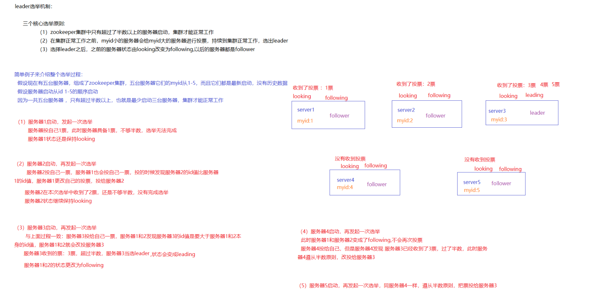
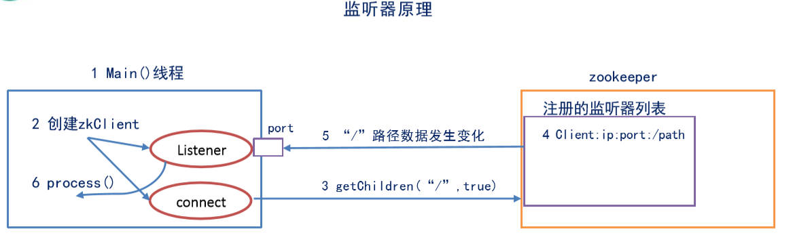
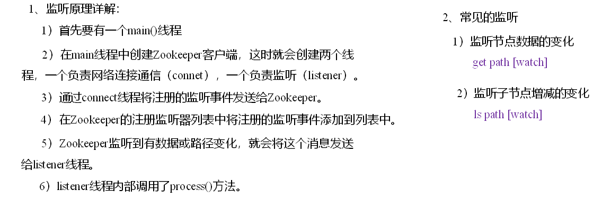
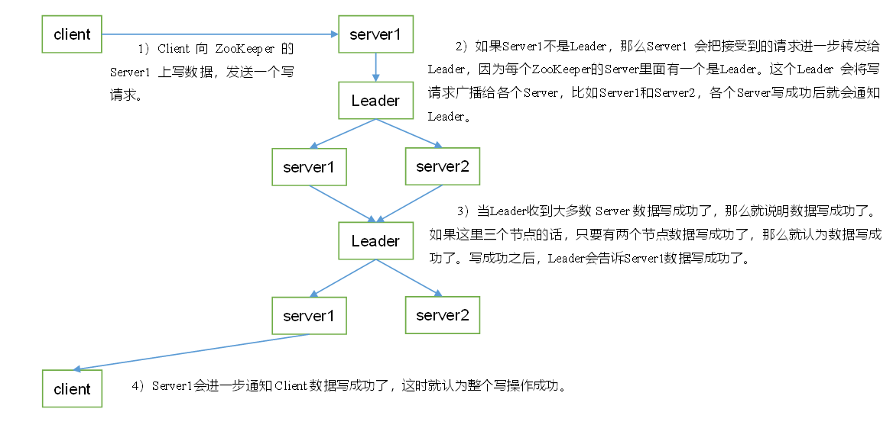

# zookeeper相关

# 一、zookeeper选举机制

1）**半数机制：集群中半数以上机器存活，集群可用。所以Zookeeper适合安装奇数台服务器。**

2）Zookeeper虽然在配置文件中并没有指定Master和Slave。但是，Zookeeper工作时，是有一个节点为Leader，其他则为Follower，Leader是通过内部的选举机制临时产生的。

3）以一个简单的例子来说明整个选举的过程。

假设有五台服务器组成的Zookeeper集群，它们的id从1-5，同时它们都是最新启动的，也就是没有历史数据，在存放数据量这一点上，都是一样的。假设这些服务器依序启动

## 二、监听机制

### 三、写请求

