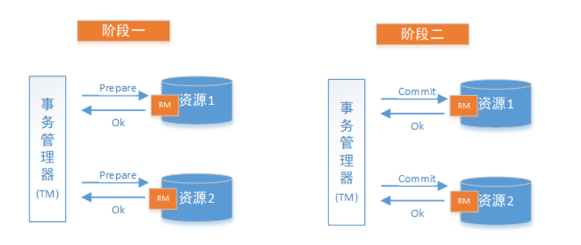
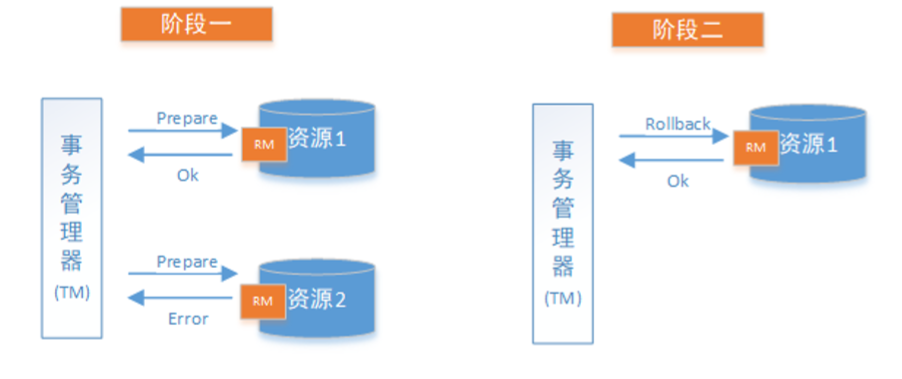

# 二阶段提交和三阶段提交

## 一、2PC

 2PC即两阶段提交协议，是将整个事务流程分为两个阶段，**准备阶段**（Prepare phase）、**提交阶段**（commit phase），2是指两个阶段，P是指准备阶段，C是指提交阶段

整个事务过程由事务管理器和参与者组成，事务管理器负责 决策整个分布式事务的提交和回滚，事务参与者负责自己本地事务的提交和回滚

在计算机中部分关系数据库如Oracle、MySQL支持两阶段提交协议，如下图：
1. 准备阶段（Prepare phase）：事务管理器给每个参与者发送Prepare消息，每个数据库参与者在本地执行事 务，并写本地的Undo/Redo日志，此时事务没有提交。 （Undo日志是记录修改前的数据，用于数据库回滚，Redo日志是记录修改后的数据，用于提交事务后写入数 据文件）
2. 提交阶段（commit phase）：如果事务管理器收到了参与者的执行失败或者超时消息时，直接给每个参与者 发送回滚(Rollback)消息；否则，发送提交(Commit)消息；参与者根据事务管理器的指令执行提交或者回滚操 作，并释放事务处理过程中使用的锁资源。注意:必须在最后阶段释放锁资源。 下图展示了2PC的两个阶段，分成功和失败两个情况说明：

    **成功情况：**

**失败情况**

* 阶段一 提交事务请求

1. 协调者向所有的参与者节点发送事务内容，询问是否可以执行事务操作，并等待其他参与者节点的
   反馈

2. 参与者节点收到协调者的事务操作后，执行操作，但不提交
3. 各参与者节点反馈给协调者，事务是否可以执行

* 阶段二 事务提交

根据一阶段各个参与者节点反馈的ack,如果所有参与者节点反馈ack，则执行事务提交，否则中断事务
事务提交：

1. 协调者向各个参与者节点发送commit请求
2. 参与者节点接受到commit请求后，执行事务的提交操作
3. 各参与者节点完成事务提交后，向协调者返送提交commit成功确认消息
4. 协调者接受各个参与者节点的ack后，完成事务commit

---

**中断事务：**
1、发送回滚请求
2、各个参与者节点回滚事务
3、反馈给协调者事务回滚结果
4、协调者接受各参与者节点ack后回滚事务

**二阶段提交存在的问题：**

* 同步阻塞
  二阶段提交过程中，所有参与事务操作的节点处于同步阻塞状态，无法进行其他的操作

* 单点问题
  参与者会一直阻塞下去。尤其在第二阶段，协调者发生故障，那么所有的参与者还都处于锁定事务资源的状态中，而无法继续完成事务操作。（如果是协调者挂掉，可以重新选举一个协调者，但是无法解决因为协调者宕机导致的参与者处于阻塞状态的问题）

* 脑裂导致数据不一致
  如果分布式节点出现网络分区，某些参与者未收到commit提交命令。则出现部分参与者完成数据提
  交。未收到commit的命令的参与者则无法进行事务提交，整个分布式系统便出现了数据不一致性现
  象。

  

##  二、3PC 三阶段提交

3PC是2PC的改进版，实质是将2PC中提交事务请求拆分为两步，形成了**CanCommit**、**PreCommit**、
**doCommit**三个阶段的事务一致性协议

**阶段一 : CanCommit**
1、事务询问
2、各参与者节点向协调者反馈事务询问的响应
**阶段二 : PreCommit**
根据阶段一的反馈结果分为两种情况

1. **执行事务预提交**
   1. 发送预提交请求
   协调者向所有参与者节点发送preCommit请求，进入prepared阶段
   2. 事务预提交
     各参与者节点接受到preCommit请求后，执行事务操作
   3. 各参与者节点向协调者反馈事务执行
2. **中断事务**
  任意一个参与者节点反馈给协调者**响应No**时，或者在**等待超时**（**协调者等待参与者**）后，协调者还未收到参与者的反
  馈，就中断事务，中断事务分为两步：
  1）协调者向各个参与者节点发送abort请求
  2）参与者收到abort请求，或者等待超时时间后，中断事务(**参与者等待协调者**)

**阶段三 : doCommit**
1、执行提交

* 发送提交请求
  协调者向所有参与者节点发送doCommit请求
* 事务提交
  各参与者节点接受到doCommit请求后，执行事务提交操作
* 反馈事务提交结果
* 事务完成
  协调者接受各个参与者反馈的ack后，完成事务

2、中断事务

1. 参与者接受到abort请求后，执行事务回滚
2. 参与者完成事务回滚以后，向协调者发送ack
3. 协调者接受回滚ack后，回滚事务

---

**3PC相较于2PC而言，解决了协调者挂点后参与者无限阻塞和单点问题，但是仍然无法解决网络分**
**区问题**